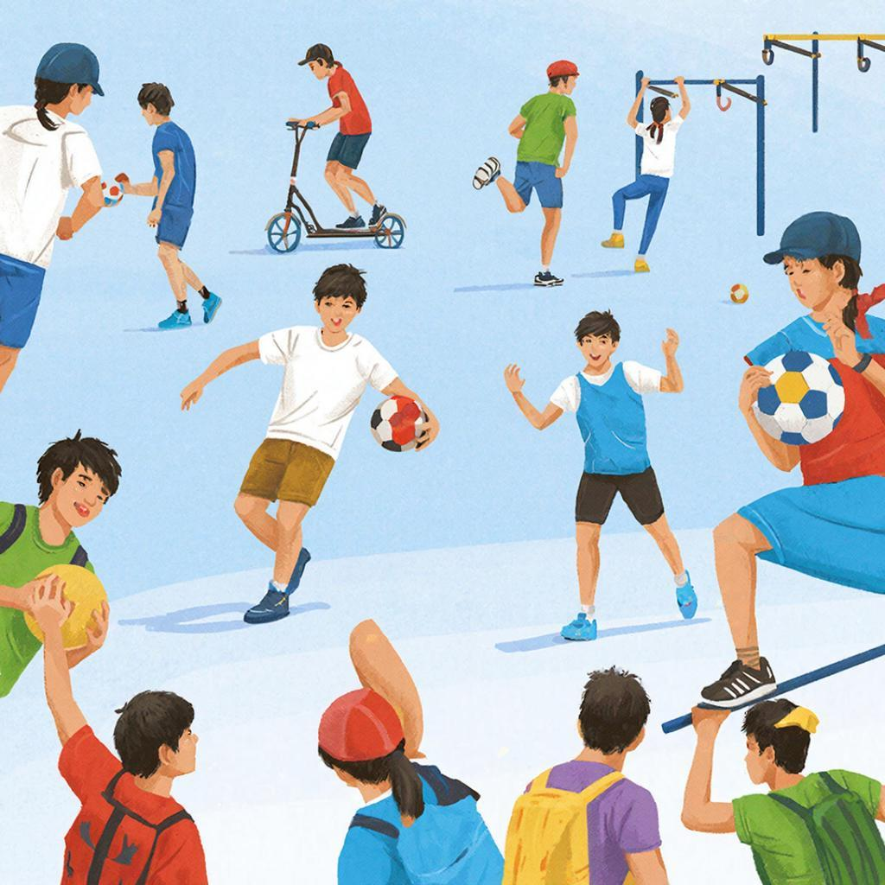

## 🏀 **Активный [отдых](safety_during_recreation.md) и спорт**  

### 🌟 Что такое активный отдых и спорт?  

**Спорт** — это организованная деятельность человека, направленная на физическое [развитие](leisure_influence_on_future.md), укрепление здоровья и достижение спортивных результатов. Спорт помогает развивать силу, выносливость, ловкость и координацию движений.  

**Активный отдых** — это любые занятия, которые помогают нам поддерживать физическую активность и получать удовольствие от движения. Это прогулки на свежем воздухе, походы, катание на велосипеде, плавание, игра в футбол или волейбол во дворе.  

📌 **Определение:**  
*Активный отдых и спорт — это виды деятельности, направленные на поддержание физической формы, улучшение самочувствия и получение положительных эмоций.*

---

### 🧐 Почему важно заниматься активным отдыхом и спортом?

Занятия спортом и активные игры укрепляют здоровье, улучшают настроение и повышают самооценку. Вот несколько важных преимуществ:  

- **Укрепление мышц и костей.** Регулярные физические нагрузки делают тело сильным и выносливым.  
- **Снижение стресса и тревоги.** Движение помогает расслабиться и снять нервное напряжение.  
- **Повышение иммунитета.** Физическая активность стимулирует иммунную систему и защищает организм от болезней.  
- **Улучшение сна и аппетита.** Активность нормализует сон и аппетит, улучшает общее самочувствие.  

---

### 🚴‍♂️ Как начать заниматься спортом и активным отдыхом?

1. **Выбери подходящий вид спорта или активности.** Попробуй разные варианты: бег, плавание, танцы, велоспорт, йога или командные игры. Найди то, что тебе понравится больше всего.  
2. **Составь план тренировок.** Определись, сколько раз в неделю ты будешь тренироваться и сколько времени выделишь на каждую тренировку.  
3. **Постепенно увеличивай нагрузку.** Начинай с небольших нагрузок и постепенно усложняй тренировки.  
4. **Найди компанию.** Заниматься вместе веселее и интереснее. Можно найти друзей или записаться в секцию.  
5. **Следи за самочувствием.** Если чувствуешь усталость или боль, обязательно отдохни и проконсультируйся с врачом.  

---

### 💪 Какие бывают виды активного отдыха и спорта?

Вот несколько популярных видов активного отдыха и спорта:  

- **Бег и ходьба.** Отличные способы укрепить сердце и легкие, улучшить выносливость.  
- **Плавание.** Полезно для всех групп мышц и суставов, развивает гибкость и дыхательную систему.  
- **Велосипедные прогулки.** Улучшают работу сердечно-сосудистой системы и поднимают настроение.  
- **Командные игры (футбол, баскетбол, волейбол).** Развивают командный дух, ловкость и координацию.  
- **Йога и пилатес.** Помогают расслабляться и улучшать гибкость тела.  

---

### 🏃‍♂️ Заключение

Занимаясь активным отдыхом и спортом, ты не только поддерживаешь свое здоровье, но и получаешь массу удовольствия от жизни. Выбирай то, что приносит радость и пользу твоему телу и душе. Пусть каждый день будет наполнен движением и позитивом!

---

*Автор: Гайдуков Александр • Сгенерировано с помощью GigaChat*