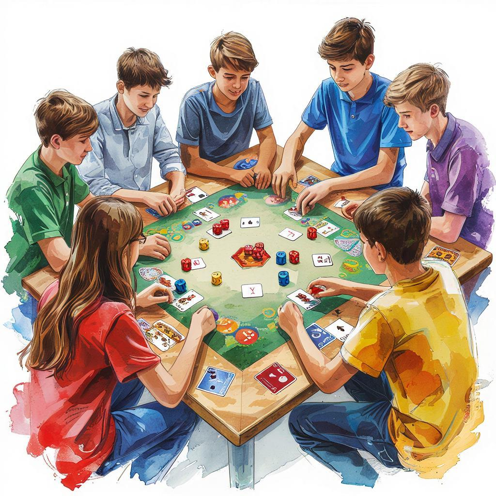

# Настольные и интеллектуальные игры 🎲📚

## Что такое настольные и интеллектуальные игры?

Настольная игра — это вид развлечения, в котором несколько человек собираются вместе и играют определёнными правилами с помощью специальных предметов: карт, фишек, кубиков, шахматных фигур и прочего 🎲  
Интеллектуальная игра подразумевает наличие правил и логического решения поставленных задач, направленная на [развитие](leisure_influence_on_future.md) умственных способностей человека ✨  

---

## История настольных игр 🌍

Первые известные настольные игры появились ещё в древности 📖
- **Древний Египет** подарил миру игру Сенет — прообраз современных шашек.
- **Китайцы** изобрели Го и шахматы.
- А знаменитая русская игра «Нарды» появилась благодаря арабским купцам.

---

## Популярные виды настольных игр 🎲

### Шахматы 👩‍⚽👨‍⚽
Шахматы развивают стратегическое мышление и учат предвидеть последствия каждого хода ☕️✨  
[Правила](safety_during_recreation.md) просты: задача игроков — поставить мат королю противника, уничтожая фигуры соперника.

### Монополия 🏦🏧
Игра знакомит с основами экономики и финансовой грамотности 💸  
Здесь ты покупаешь недвижимость, строишь дома и отели, сдаёшь в аренду своим соперникам.

### Нарды 🐝
Русская народная игра, известная своей простотой и тактическим мастерством 😄  
Цель игрока — провести все свои шашки через игровое поле раньше соперника.

---

## Польза от настольных игр 🤗

- [Развитие](leisure_influence_on_future.md) логики и аналитического мышления.
- Улучшение памяти и концентрации внимания.
- Тренировка стратегического планирования.
- Возможность весело провести время с друзьями и семьёй.

---

## Интеллектуальные игры 📚

Интеллектуальные игры бывают командными и индивидуальными 📑  
Они стимулируют мозг, улучшают память и внимание, повышают уровень знаний 🔬  
Примеры популярных интеллектуальных игр:
- «Что? Где? Когда?» 📺  
- «Брэйн ринг» 📈  
- викторины и квизы 📊  

Эти игры отлично подходят для развития кругозора и подготовки к олимпиадам 📜

---

## Правила безопасности 🛠️

Чтобы получать удовольствие от игр и избегать неприятностей, важно соблюдать [правила](safety_during_recreation.md) безопасности:
- Играй честно и соблюдай правила.
- Не спорь излишне громко, уважай других участников.
- Избегай агрессии и негативных эмоций во время игры.

---

## Заключение 📚

Настольные и интеллектуальные игры — отличное средство отдыха и саморазвития 🎯 Они помогают расслабиться после учёбы, тренируют умственную активность и укрепляют дружбу среди друзей и семьи. Главное — играть искренне и с удовольствием!

---

*Автор: Гусев Савелий • Сгенерировано с помощью GigaChat*