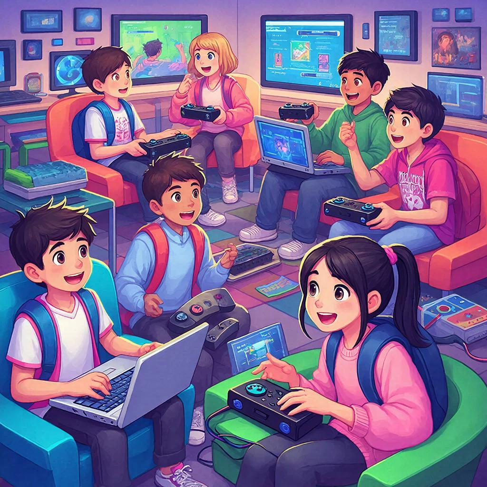

## 🎮 Компьютерные игры: как играть с пользой 🌐

### 📚 Определение

Компьютерная игра — это интерактивное развлечение, которое происходит на экране компьютера или другого устройства. Игры бывают разные: от простых головоломок до сложных стратегий, симуляторов и шутеров. Но почему же мы говорим про пользу?

---

### 💡 Зачем вообще полезны компьютерные игры?

Давай разберёмся вместе!

#### 🔸 [Развитие](leisure_influence_on_future.md) внимания и реакции
Игры помогают тренировать внимание и скорость реакции. Например, когда ты быстро решаешь головоломки или стреляешь по врагам, мозг учится быстрее обрабатывать информацию.

**Пример:** Игра «Counter-Strike» помогает развивать реакцию и умение мгновенно принимать решения.

#### 🔸 Улучшение координации движений
Современные игры часто требуют движения мышью или джойстиком, что развивает моторику рук и координацию движений.

**Пример:** Симуляторы вождения («Need for Speed») отлично тренируют управление автомобилем.

#### 🔸 Тренировка стратегического мышления
Стратегические игры учат планировать, думать наперёд и анализировать ситуацию. Ты строишь города, защищаешь базы или создаёшь армии.

**Пример:** Стратегия «Цивилизация» учит управлять ресурсами, вести войны и заключать союзы.

#### 🔸 [Обучение](reading_and_self_education.md) новым знаниям
Некоторые игры содержат полезную информацию, помогающую узнавать новое о науке, истории или культуре.

**Пример:** В игре «Stardew Valley» ты изучаешь основы сельского хозяйства, садоводства и животноводства.

---

### 🛠️ Как выбрать полезные игры?

Чтобы извлечь максимум пользы, нужно выбирать правильные игры.

1. **Изучай отзывы и рейтинги.** Узнай мнение экспертов и игроков о той или иной игре.
   
2. **Определи цель игры.** Если хочешь развить реакцию — выбирай экшены. Если интересуют новые знания — образовательные игры.

3. **Ограничивай время.** Не забывай про [баланс](balance_study_rest_hobby.md) между играми и реальной жизнью.

---

### 🏆 Лучшие игры для развития

Вот несколько классных игр, которые точно принесут тебе пользу:

- **«Civilization VI»** — стратегическая игра, развивающая мышление и [планирование](time_for_hobby_daily_routine.md).
  
- **«Minecraft»** — образовательная игра, где можно изучать физику, архитектуру и инженерию.

- **«The Witcher III»** — приключенческая игра с глубоким сюжетом и моральными дилеммами.

- **«Portal 2»** — головоломка, развивающая пространственное [мышление](board_and_intellectual_games.md).

---

### 👨‍💻 Советы родителям

Родителям важно понимать, какие игры подходят детям разных возрастов. Вот несколько рекомендаций:

- **Контролируй продолжительность игры.** Ограничивай время, проведённое перед экраном.
  
- **Выбирай подходящие жанры.** Для младших детей лучше подойдут пазлы и простейшие стратегии.

- **Обсуждай игру после неё.** Спрашивай ребёнка, чему он научился или что узнал нового.

---

### 📅 Заключение

Компьютерные игры могут приносить огромную пользу, если подходить к ним осознанно. Они развивают ум, тело и расширяют [кругозор](reading_and_self_education.md). Главное — правильно выбирать игры и соблюдать баланс между виртуальным миром и реальной жизнью.

---

*Автор: Заворотный Алексей • Сгенерировано с помощью GigaChat*