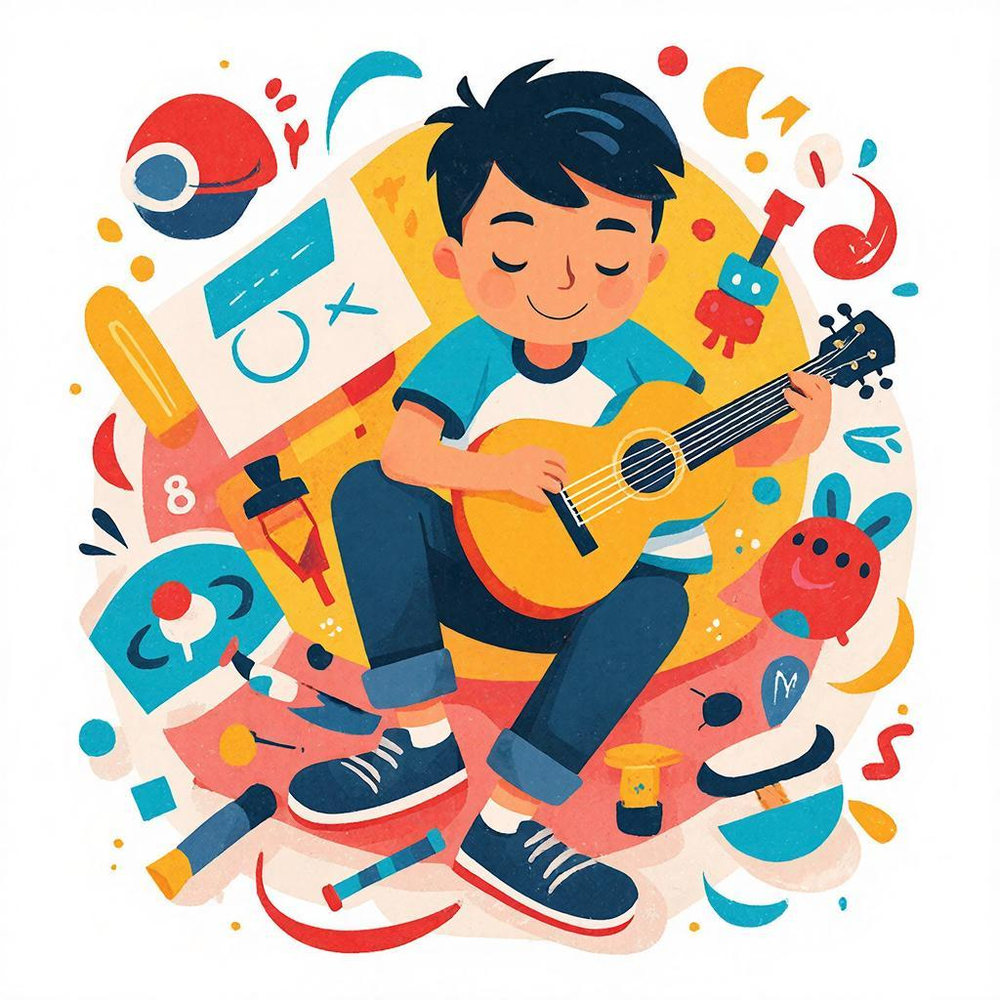

## 🎨 Почему мы бросаем [хобби](time_for_hobby_daily_routine.md)?

### Определение

[Хобби](time_for_hobby_daily_routine.md) — это увлечение человека, которое приносит удовольствие и радость от процесса. Однако многие ребята сталкиваются с проблемой: энтузиазма хватает всего на несколько дней или недель, а потом интерес пропадает. 🤔 Это происходит потому, что не всегда удаётся грамотно организовать своё время и усилия.

---

## 📚 Что нужно сделать, чтобы хобби стало твоим другом навсегда?

### Постановка целей

Первое правило успешного занятия любимым делом — **цели**. Без чёткого понимания, зачем тебе это нужно, сложно будет двигаться вперёд. 🌟 Например, хочешь научиться играть на гитаре? Отличная цель! Но уточни её подробнее: ты хочешь выступать на сцене или просто радовать себя любимой музыкой дома?

**Совет:** перед началом нового дела обязательно подумай, какие именно результаты тебя вдохновляют!

---

## 💪 Разработка плана действий

После постановки цели важно составить план, где будут указаны конкретные шаги. ✅ Если планируешь рисовать каждый день хотя бы по полчаса, ставь себе напоминание или записывай расписание прямо в дневник. Не забывай радоваться даже маленьким успехам!

---

## 🕺 Поддержка друзей и семьи

Часто поддержка близких людей играет ключевую роль в успешности любого начинания. 👥 Попробуй рассказать друзьям и семье о своём новом увлечении, попроси помощи или совета. Они могут подсказать интересные [идеи](free_leisure_activities.md) или даже присоединиться к твоему хобби вместе с тобой.

---

## 🍃 Преодоление трудностей

Каждый человек сталкивается с трудностями на пути к своей мечте. Важно помнить, что **это нормально**! 🐾 Если вдруг захочется всё бросить, попробуй проанализировать причины своего разочарования. Возможно, дело просто в недостатке мотивации или усталости. Найди способ справиться с этими проблемами самостоятельно или обратись за помощью к близким людям.

---

## 🛠 Саморазвитие и обучение

Регулярное [развитие](leisure_influence_on_future.md) и обучение помогут поддерживать твой интерес надолго. 📚 Например, изучай новые техники рисования, игры на музыкальных инструментах или рецепты блюд в кулинарии. Ты почувствуешь себя настоящим профессионалом, когда сможешь делиться своими знаниями и опытом с окружающими.

---

## 🏆 Заключение

Чтобы хобби приносило радость долгое время, нужно подходить к нему осознанно. 🎯 Постарайся следовать простым правилам: ставить цели, планировать свою деятельность, получать поддержку от окружающих и регулярно развиваться. Только тогда твоя страсть превратится в любимое занятие на всю жизнь!

---

*Автор: Гусев Савелий • Сгенерировано с помощью GigaChat*