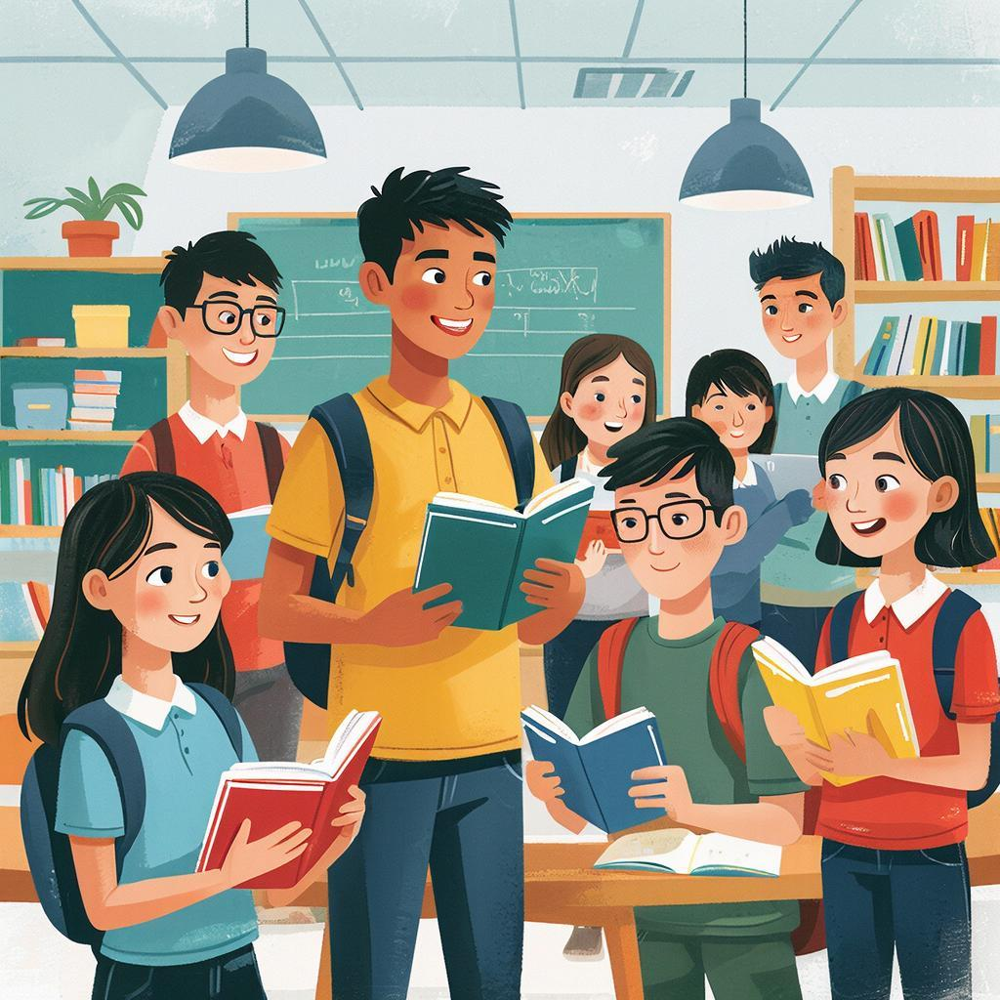

# 📚 Чтение и самообразование

## Определение и [значение](leisure_and_why_need.md) 🎓📖

Чтение и самообразование — это важные составляющие интеллектуального развития человека. **Чтение** помогает получать знания, расширять кругозор и развивать [мышление](board_and_intellectual_games.md). Самообразование же предполагает самостоятельное изучение различных областей знаний, стремление постоянно учиться новому.

## Почему важно читать? ☁️📚

### Расширение кругозора  
Чтение книг позволяет узнать больше о мире вокруг нас, о людях, культурах и эпохах. Это открывает новые горизонты и делает жизнь интереснее.

### [Развитие](leisure_influence_on_future.md) воображения  
Книги помогают развивать воображение и фантазию. Читая художественную литературу, ты погружаешься в вымышленные миры, учишься видеть события глазами героев.

### Улучшение речи и письма  
Регулярное чтение способствует улучшению грамотности и выразительности речи. Ты начинаешь лучше понимать структуру предложений, лексику и стилистические приёмы.

### Саморазвитие и личностный рост  
Самообразование развивает критическое мышление, учит анализировать информацию и принимать взвешенные решения. Ты становишься более уверенным и компетентным человеком.

---

## Как правильно организовать процесс чтения 📝📖

1. **Выбирай интересные книги**. Не заставляй себя читать то, что тебе совсем не нравится. Найди жанры и авторов, которые вызывают [интерес](how_not_to_quit_hobby.md).
   
2. **Создай комфортные условия**. Выбери удобное место, где тебя ничто не отвлекает. Если сложно сосредоточиться дома, попробуй читать в библиотеке или парке.

3. **Ставь себе [цели](how_not_to_quit_hobby.md)**. Определи количество страниц или книг, которые хочешь прочитать за месяц или год. Так будет проще отслеживать прогресс.

4. **Делись впечатлениями**. Обсуждай прочитанное с друзьями или близкими. Это поможет глубже понять текст и расширить круг знакомств.

---

## Иллюстрация: описание темы  

---

## Заключение 💡🌟

Чтение и самообразование открывают перед нами огромный мир возможностей. Они способствуют развитию личности, обогащению внутреннего мира и формированию культурного багажа. Уделяй время чтению каждый день, и вскоре заметишь положительные изменения в своей жизни!

!ВАЖНО: В тексте статьи обязательно используй приведённую выше строку для изображения 📸

---

*Автор: Миронов Данил • Сгенерировано с помощью GigaChat*