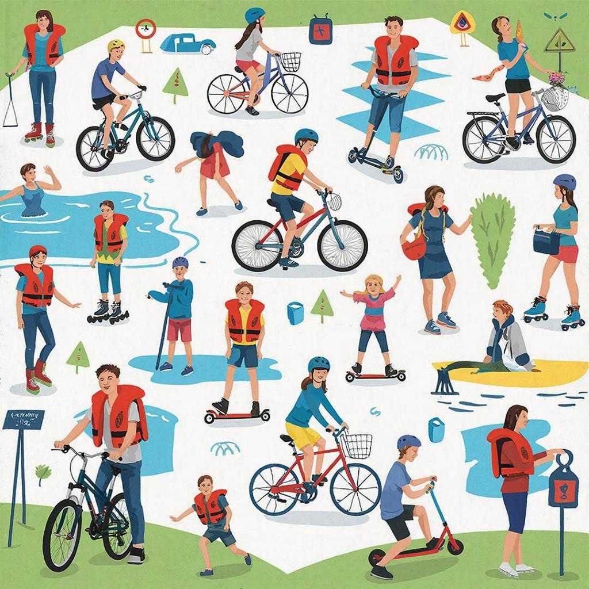

# 🌿 Безопасность во время отдыха 🌱

## Определение безопасности во время отдыха

**Безопасность во время отдыха** — это умение правильно вести себя в разных ситуациях, чтобы избежать травм, несчастных случаев и неприятных происшествий. Соблюдение простых правил помогает наслаждаться активным отдыхом и проводить время весело и комфортно.

---

## Заголовок: Правила поведения на природе 🌲💨

### ⚠️ Что нужно помнить перед походом?

Перед тем как отправиться отдыхать на природу, обязательно изучи прогноз погоды и составь план маршрута. Возьми с собой аптечку первой помощи, воду и еду, подходящую погоде. Не забудь надеть удобную одежду и обувь.

### 🛂 Как передвигаться по лесу?

При движении по тропинкам придерживайся центра дорожки, чтобы случайно не наступить на ветки или корни деревьев. Если тропинки нет, двигайся осторожно, проверяя путь палкой перед собой, особенно по каменистым участкам или болотистой местности.

### 🐔 Осторожность рядом с животными

На природе часто встречаются дикие животные, такие как ежи, лисы или змеи. Чтобы избежать неприятностей, старайся не приближаться близко к животным и не трогай их руками. Змеиный укус опасен, поэтому не трогай гадюк руками и аккуратно обходи места их обитания.

---

## Заголовок: Поведение на воде 🌊🏖️

### 🏄‍♂️ Купание и плавание

Купаясь в водоемах, выбери место с чистой водой и ровным дном. Обязательно надень спасательный жилет или нарукавники для детей. Избегай глубоких мест и бурлящих потоков воды. Никогда не купайся один и всегда сообщай родителям или друзьям о своем местонахождении.

### 🤣 Играем безопасно!

Игры на воде, такие как волейбол или бадминтон, должны проходить вдали от берега и плавающих предметов. Старайся избегать прыжков в воду с высоты больше метра и попадания предметов под ноги.

---

## 🎯 Важные моменты во время активного отдыха 🧗‍♀️🦸‍♂️

### ✅ Оставляем природу чистой

Во время похода не оставляй мусор после себя. Собирай пустые бутылки, пакеты и другой мусор, который можешь найти вокруг. Береги растения и животных, не ломай деревья и не лови редких насекомых.

### 📞 Связь с родителями

Всегда сообщай близким людям, куда ты идешь и когда планируешь вернуться. Это поможет избежать переживаний и ненужных тревог.

---

## Заключение 🍃✨

Соблюдая эти несложные правила, ты сможешь провести время активно и безопасно, наслаждаясь каждым моментом своего отдыха. Помни, безопасность начинается с тебя самого!

---

*Автор: Кондратенко Александр • Сгенерировано с помощью GigaChat*