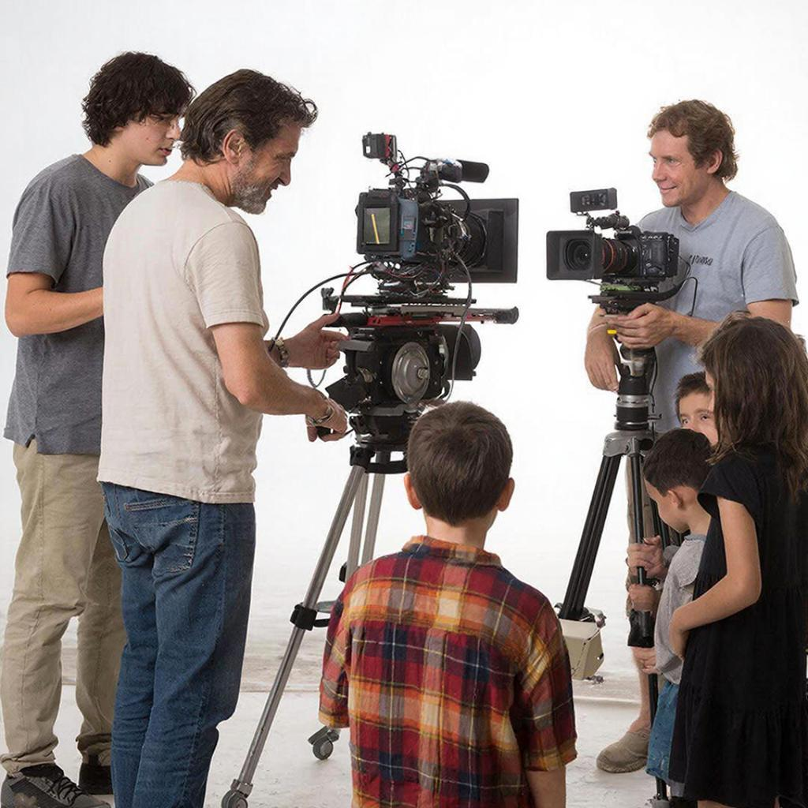

# Режиссёр — волшебник сцены и экрана

## Кто такой режиссёр?
Режиссёр — это человек, который руководит процессом создания [фильмов](movie.md), спектаклей, концертов и телевизионных передач. Он словно художник, создающий картину своей мечты, используя краски, свет, [музыку](music.md) и слова актёров.

## Что делает режиссёр?
На съёмочной площадке режиссёра называют главным волшебником. Именно он решает, каким будет [фильм](movie.md) или спектакль целиком: какую атмосферу создаст, какие [эмоции](psychology_of_music.md) почувствуют зрители, какой [сюжет](script.md) выберут герои.

### В театре
Театральный режиссёр помогает актёрам раскрыть образы персонажей через движения, мимику и голос. Он придумывает декорации и костюмы, выбирает исполнителей главных ролей, следит за режиссурой каждого спектакля и корректирует игру артистов прямо во время выступления.

### В кино
Киношный режиссёр работает совсем иначе. Он снимает кадры камеры, управляет актёрами, даёт команды операторам и осветителям, принимает решения о том, где поставить свет, куда направить камеру и как правильно выстроить кадр.

## Как стать режиссёром?
Чтобы стать режиссёром, нужно много учиться и практиковаться. Обычно начинающие режиссёры учатся в театральных училищах или киношколах, изучают историю искусства, сценическое мастерство и драматургию. Затем пробуют себя в маленьких проектах, снимают короткие [фильмы](movie.md) или участвуют в постановках театров.

С опытом приходит понимание, как устроена работа команды, и умение вести людей за собой, вдохновлять их творить вместе с тобой удивительные истории.

## Знаменитые режиссёры
Среди знаменитых режиссёров есть много известных имён:

- **Сергей Эйзенштейн** — советский режиссёр, известный своими новаторскими подходами в [киноискусстве](movie.md).
- **Фрэнсис Форд Коппола** — американский режиссёр, снявший легендарную трилогию о персонаже Дарт Вейдер (Звёздные войны).
- **Акира Куросава** — японский режиссёр, прославившийся яркими историческими [драмами](movie.md) и приключениями.

Каждый из них создавал особенные миры, в которых зрители оказывались героями историй.

## Заключение
Режиссура — увлекательная профессия, позволяющая выразить свою фантазию, вдохновение и чувства перед зрителями. Это искусство, объединяющее разные виды творчества, будь то театр, [кино](movie.md) или телевидение. Быть режиссёром значит мечтать, видеть необычное там, где другие видят обыденность, и воплощать эти идеи в жизнь!

---
Автор: Хереш Артемий

*LLM - GigaChat*

