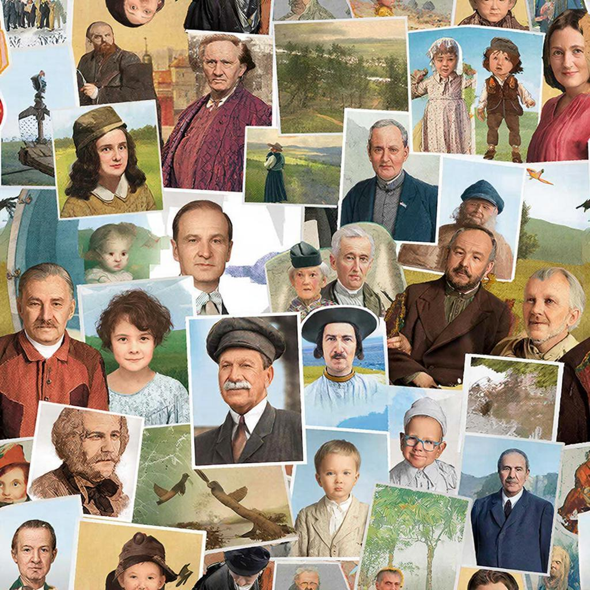

# Документальный фильм

## Введение
Представь себе, что ты смотришь интересный [фильм](movie.md) про динозавров или путешествие по джунглям Амазонки. Но вдруг понимаешь, что всё происходящее реально! Это и есть документальный фильм – кино, которое показывает настоящие события, людей и места. Такие [фильмы](movie.md) снимают специально, чтобы рассказать правду о том, что происходит вокруг нас.

## История
Давным-давно, ещё в начале XX века, люди начали снимать первые документальные фильмы. Например, Жорж Мельес снимал короткометражки про реальные события, а братья Люмьер показывали зрителям настоящую жизнь улиц Парижа. С тех пор документальное кино сильно изменилось:

### Этап первый: начало
В начале XX века появились простые съёмки природы и хроники событий. Люди впервые увидели войны, катастрофы и важные исторические моменты.

### Этап второй: расцвет
В середине XX века документалистика стала популярной благодаря таким [режиссёрам](director.md), как Майкл Мур и Вернер Херцог. Они показали миру множество интересных историй через свои фильмы.

## Основные виды или разновидности
Есть несколько видов документальных фильмов, которые отличаются друг от друга темами и подходом к съёмке:

### Образовательное кино
Это фильмы, которые учат чему-то новому. Например, можно узнать про космос, животных или историю разных стран.

### Горный фильм
Такие фильмы показывают приключения альпинистов и путешественников, поднимающихся высоко в горы.

### Мокьюментари
Это смешной жанр, когда [режиссёр](director.md) делает вид, будто снимает реальную жизнь, но на самом деле всё подстроено. Представь, что кто-то снял видео про группу друзей, играющих в компьютерную игру, а потом показал его всем, будто это настоящая история!

### Docutainment
Здесь смешиваются игровые элементы и документальные съёмки. Например, фильм рассказывает о реальной истории, но добавляет немного вымысла для драматизма.

## Интересные факты
Вот несколько любопытных фактов о документальном кино:

- **Первый звуковой документальный фильм** появился в США в 1927 году и назывался "Wings of the Morning".
- **Самый длинный документальный фильм** называется "Leviathan" и длится целых 131 минуту.
- **Самое короткое документальное кино** – всего одна секунда! Оно называется "The World's Shortest Film".

## Примеры из жизни
Посмотри такие фильмы, как:

- **«Трагедия в Катынском лесу»** – рассказ о страшном событии Второй мировой войны.
- **«Being Frank: The Chris Sievey Story»** – история о человеке, который притворялся другим знаменитым человеком.
- **«Q5981070»** – фильм о необычных людях и их увлечениях.

## Польза
Почему стоит смотреть документальные фильмы? Вот несколько причин:

- Узнаёшь много нового и интересного.
- Учишься мыслить критически, задавая вопросы и проверяя информацию.
- Получаешь вдохновение для собственных идей и проектов.

## Возможные риски
Как и любое другое кино, документальные фильмы могут иметь негативные стороны:

- Иногда они слишком грустные или пугающие.
- Могут показывать неприятные события, которые тяжело воспринимать маленьким детям.

## Баланс пользы и развлечения
Чтобы получить максимум удовольствия и пользы от просмотра документального фильма, следуй этим простым советам:

- Выбирай подходящие возрасту фильмы.
- Обсуждай увиденное вместе с родителями или друзьями.
- Не забывай отдыхать после тяжёлых тем.

## Заключение
Теперь ты знаешь, что документальные фильмы – это настоящее окно в реальный мир. Они помогают нам лучше понимать окружающий мир и учиться новому. Так что смело включай любимый документальный фильм и открывай для себя новые горизонты знаний!

---
Автор: Глушко Игорь
*LLM - 
GigaChat*

