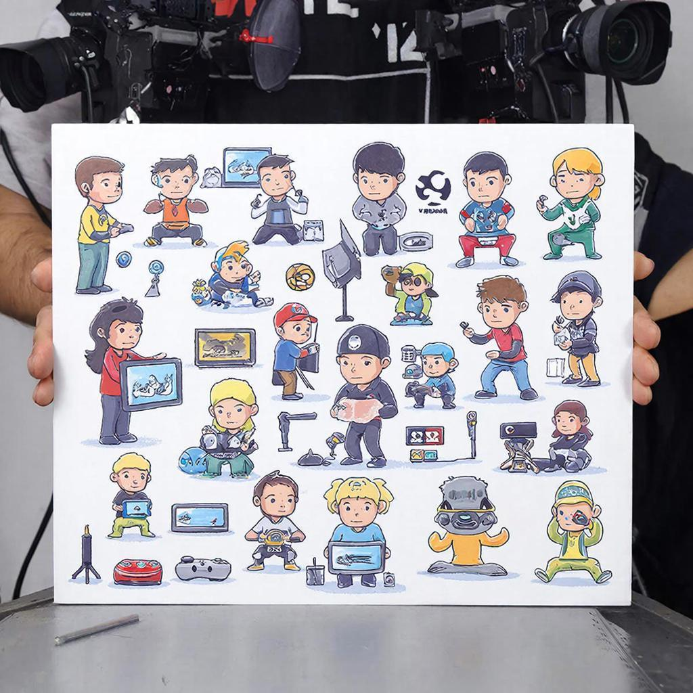

# Киберспорт

В наше время технологии шагнули далеко вперёд, и теперь можно соревноваться не только в спортивных залах или на стадионах, но и сидя за компьютером! Это называется **киберспорт** – спортивные соревнования по [видеоиграм](history-of-games.md), которые проводятся с применением компьютерных технологий.

## История

История киберспорта началась довольно давно, ещё в конце XX века. Первые турниры проходили в игровых клубах и на выставках электроники. Но настоящий прорыв произошёл в начале XXI века, когда интернет стал доступен практически каждому человеку. Именно тогда начали появляться первые крупные чемпионаты и лиги, такие как Intel Extreme Masters и DreamHack. Сегодня киберспорт развивается во всём мире, привлекая миллионы зрителей и участников.

### Ключевые этапы развития:
- **1990-е годы:** зарождение первых соревнований среди геймеров.
- **2000-е годы:** появление профессиональных лиг и турниров.
- **2010-е годы:** рост популярности киберспорта благодаря широкому распространению интернета и развитию онлайн-трансляций.

## Основные виды или разновидности

Существует множество различных дисциплин и видов киберспорта. Вот самые популярные из них:

### Игры-шутеры
Это игры, в которых нужно быстро реагировать и стрелять по врагам. Например, Counter-Strike, Call of Duty и Apex Legends. Представь себе, что ты играешь в игру, где тебе нужно защищать свою команду от врагов!

### Стратегии в реальном времени (RTS)
Здесь главное – стратегическое мышление и управление ресурсами. Популярные представители – StarCraft II, Warhammer: Age of Sigmar и Dota 2. Здесь важно думать наперёд и планировать свои действия.

### Спортивные симуляторы
Эти игры имитируют реальные виды спорта, например гонки (Need for Speed) или футбол (FIFA). Ты можешь почувствовать себя настоящим гонщиком Формулы-1 или футболистом сборной Англии!

## Интересные факты

Вот несколько интересных и забавных фактов о киберспорте:

- **Первый чемпионат мира по компьютерному спорту состоялся в Южной Корее.** Там до сих пор очень развит этот вид спорта.
- **Средний возраст игроков в киберспорт составляет около 25 лет**, хотя есть команды и для подростков.
- **Самые дорогие призы за победу в турнирах достигают миллионов долларов.** Представь, сколько денег можно выиграть, если стать чемпионом!

## Примеры из жизни

Вот несколько известных примеров команд и игр, популярных среди детей и подростков:

- **Team Liquid** – одна из самых успешных команд по игре Dota 2.
- **ESAILING TEAM WORLD CHAMPIONSHIP** – турнир по виртуальному парусному спорту.
- **League of Legends** – популярная многопользовательская онлайн-игра, в которой соревнуются две команды по пять человек.

## Польза

Киберспорт приносит много пользы:

- **Развивает реакцию и внимание.** Когда ты играешь в шутеры или [стратегии](game-genres.md), твой мозг постоянно работает над принятием решений.
- **Улучшает навыки общения и работы в команде.** Многие игры требуют кооперации между игроками, чтобы победить.
- **Повышает уверенность в себе и стрессоустойчивость.** Регулярные тренировки помогают справляться со сложными ситуациями.

## Возможные риски

Как и любое увлечение, киберспорт имеет свои минусы:

- **Зависимость от игр.** Если проводить слишком много времени за играми, можно упустить важные дела и занятия.
- **Проблемы со здоровьем.** Долгое сидение перед экраном может привести к усталости глаз и проблемам с осанкой.

## Баланс пользы и развлечения

Чтобы получать максимум пользы и удовольствия от киберспорта, важно соблюдать баланс:

- **Не забывай про отдых и физическую активность.** Делай перерывы каждые полчаса и занимайся спортом.
- **Выбирай правильные игры.** Лучше всего играть в те игры, которые развивают полезные навыки.
- **Учись управлять временем.** Установи лимиты на количество часов, проведённых за игрой.

## Заключение

Итак, киберспорт – это увлекательное и развивающее занятие, которое объединяет людей по всему миру. Главное – помнить о балансе и заботиться о своём здоровье.

---
Автор: Долбус Дмитрий

*LLM - GigaChat*

