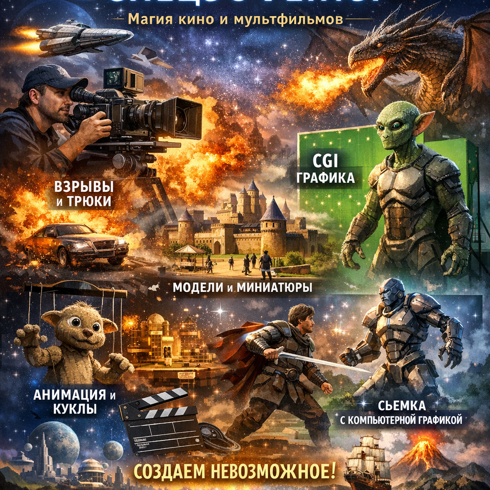

# Жанры видеоигр

[Видеоигры](history-of-games.md) – это не просто развлечение, а целый мир приключений, стратегий и открытий! Они бывают разных видов, которые называются жанрами. Каждый жанр предлагает игрокам уникальные возможности и задачи, делая игровой процесс разнообразнее и интереснее.

## 1. Введение
Жанры [видеоигр](history-of-games.md) помогают разработчикам создавать игры, подходящие под разные интересы и предпочтения игроков. Например, любишь ли ты строить города, исследовать фантастические миры или сражаться с врагами? Для каждого такого желания есть свой жанр!

## 2. История
Первые видеоигры появились ещё в середине XX века, но тогда они были очень простыми и примитивными. Со временем технологии развивались, и разработчики начали придумывать новые жанры игр. Сегодня мы можем увидеть множество различных жанров, каждый из которых имеет свою историю и особенности.

### Этап первый: аркадные игры
В начале своего пути видеоигры были похожи на автоматы в игровых залах. Игроки вставляли монеты и пытались набрать максимальное количество очков за короткое время.

### Этап второй: ролевые игры (RPG)
Позже появились ролевые игры, где игроки могли управлять персонажем, развивать его навыки и путешествовать по огромному миру. Это был настоящий прорыв в мире видеоигр!

### Этап третий: стратегия
Стратегии стали популярными благодаря играм, где нужно было планировать свои действия и принимать важные решения, чтобы победить противника.

## 3. Основные виды или разновидности
Есть несколько основных жанров видеоигр:

### **Стратегии**
Это игры, где игрок управляет ресурсами, войсками и строениями, планируя будущие действия. Например, игра "Цивилизация" позволяет построить целую цивилизацию от древних времён до будущего.

### **Шутеры**
Здесь главное – быстро реагировать и стрелять в противников. Популярные шутеры включают "Call of Duty" и "Counter-Strike".

### **RPG (ролевые игры)**
В таких играх можно выбрать персонажа и развивать его способности, исследуя огромный открытый мир. Пример – "The Witcher", где главный герой отправляется в приключения и решает сложные задачи.

### **Симуляторы**
Эти игры позволяют игроку почувствовать себя пилотом самолёта, водителем автомобиля или даже космонавтом. Один из самых известных симуляторов – "Microsoft Flight Simulator".

### **Платформеры**
В этих играх нужно прыгать между платформами, избегая врагов и собирая бонусы. Классический пример – "Super Mario".

## 4. Интересные факты
Вот несколько интересных фактов о жанрах видеоигр:

- **Первая многопользовательская онлайн-игра:** Dungeons & Dragons Online появилась в 2001 году и позволила игрокам со всего мира объединяться в команды и вместе проходить приключения.
  
- **Самая продаваемая серия игр:** Minecraft продала более 200 миллионов копий по всему миру и стала одной из самых популярных игр всех времён.

- **Самый длинный игровой сериал:** Final Fantasy насчитывает уже более двух десятков частей, каждая из которых рассказывает новую захватывающую историю.

## 5. Примеры из жизни
Вот несколько примеров известных игр, подходящих разным возрастам:

- Minecraft – отличная игра для строительства и исследования мира.
- Stardew Valley – увлекательная ферма, где можно выращивать овощи и дружить с жителями деревни.
- Rocket League – веселый футбольный матч, только вместо ног у машинок двигатели!

## 6. Польза
Видеоигры могут приносить много пользы:

- Развивают логику и стратегическое мышление.
- Улучшают реакцию и координацию движений.
- Помогают учиться новым навыкам и технологиям.

## 7. Возможные риски
Как и любое занятие, видеоигры требуют разумного подхода. Долгое сидение перед экраном может привести к усталости глаз и проблемам со здоровьем. Важно помнить о балансе и делать перерывы каждые полчаса.

## 8. Баланс пользы и развлечения
Чтобы получать максимум удовольствия и пользу от видеоигр, важно соблюдать следующие правила:

- Не играть слишком долго подряд.
- Делать регулярные перерывы.
- Выбирать игры, соответствующие твоему возрасту и интересам.

## 9. Заключение
Видеоигры – это отличный способ провести свободное время весело и с пользой. Главное – помнить о мере и выбирать игры, которые подходят именно тебе.

---
Автор: Долбус Дмитрий

*LLM - GigaChat*

