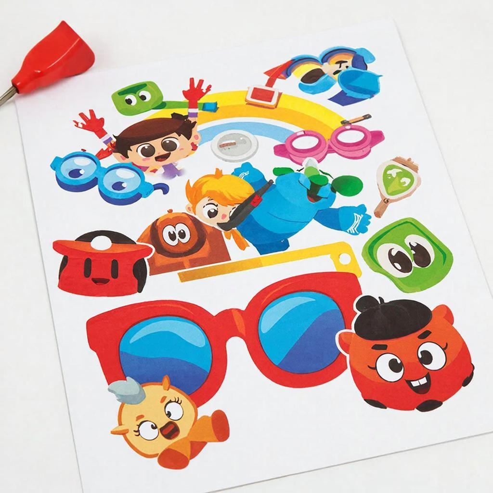

# Геймификация

## Что такое геймификация?

Представь себе, что учёба – это не скучный урок за партой, а захватывающая игра! Именно так работает геймификация. Это способ сделать обычные занятия интересными и увлекательными, используя элементы игр. Например, ты можешь получать баллы за хорошие оценки, проходить уровни по мере изучения новых тем и даже соревноваться с друзьями!

**Зачем нужна геймификация?**
Она помогает людям легче усваивать информацию, мотивирует их достигать целей и делает процесс обучения более приятным. Представь, если бы тебе платили конфеты за каждую прочитанную книгу или разрешали играть в любимую игру после выполнения домашнего задания!

## История геймификации

Геймификация появилась давно, ещё до того, как появились компьютеры и смартфоны. Люди всегда любили игры и соревнования, поэтому уже древние греки использовали элементы соревнований и наград для поощрения учеников. Со временем эта идея развивалась и становилась всё популярнее.

В **XX веке** геймификацию начали активно применять в бизнесе и образовании. Компании поняли, что сотрудники охотнее выполняют задачи, если видят перед собой интересные цели и награды. А учителя заметили, что ученики лучше учатся, когда уроки проходят весело и интересно.

Сегодня геймификация стала частью нашей повседневной жизни благодаря интернету и технологиям. Она используется везде: от спортивных приложений до образовательных платформ и даже в играх на приставках и телефонах.

## Основные виды геймификации

Есть несколько видов геймификации:

### 1. Награды и достижения
Это когда за выполнение определённых задач ты получаешь виртуальные медали, значки или очки. Например, в приложении для чтения книг можно получить звезду за прочтение каждой новой книги.

### 2. Уровень прогресса
Здесь ты проходишь разные уровни, выполняя задания и достигая целей. Это похоже на прохождение уровней в игре Minecraft, где ты строишь дом, затем замок и дальше – космический корабль!

### 3. Соревнования и рейтинги
Когда ты соревнуешься с другими людьми и видишь свои результаты в рейтинге. Например, в спортивном приложении ты можешь видеть, кто из твоих друзей пробежал больше километров или сделал больше приседаний.

## Интересные факты

Вот несколько интересных фактов про геймификацию:

- **Первый случай использования геймификации:** В Древнем Риме гладиаторы получали медали и почётные титулы за победы в боях.
  
- **Самая популярная система достижений:** На платформе Xbox Live игроки получили более миллиарда виртуальных медалей!

- **Самое длинное слово в мире:** Если собрать все достижения игрока в популярной игре The Witcher 3, получится самое длинное слово в [истории видеоигр](history-of-games.md) – оно состоит из 10 тысяч символов!

## Примеры из жизни

Посмотри вокруг себя – геймификация окружает нас повсюду:

- **Приложения для фитнеса:** Ты можешь отслеживать свою физическую активность, видеть прогресс и соревноваться с друзьями.
  
- **Образовательные платформы:** Такие сайты, как Duolingo, используют геймификацию, чтобы помочь изучать иностранные языки весело и легко.

- **Мобильные игры:** Игры типа Clash of Clans или Pokemon Go привлекают миллионы игроков именно благодаря интересным заданиям и наградам.

## Польза геймификации

Геймификация приносит много пользы:

- **Улучшение мотивации:** Когда ты видишь перед собой цель и знаешь, какие шаги нужно сделать, учиться становится проще и интереснее.
  
- **Развитие навыков:** Выполняя различные задания, ты учишься новым вещам и развиваешь полезные навыки.

- **Повышение самооценки:** Получая награды и достижения, ты чувствуешь гордость за свои успехи и уверенность в своих силах.

## Возможные риски

Как и у любой вещи, у геймификации есть свои минусы:

- **Зависимость от технологий:** Некоторые люди могут слишком сильно увлечься играми и забыть о реальной жизни.
  
- **Неравенство:** Не все имеют доступ к современным технологиям и играм, поэтому геймификация может создать неравенство между детьми.

## Баланс пользы и развлечения

Чтобы геймификация приносила только пользу, важно соблюдать баланс:

- **Ограничивай время:** Старайся проводить за играми и приложениями не больше часа в день.
  
- **Комбинируй:** Учись использовать геймификацию для учёбы, но не забывай заниматься спортом и общаться с друзьями.

## Заключение

Геймификация – это отличный способ сделать нашу жизнь ярче и интереснее. Главное – помнить о балансе и не забывать о реальной жизни.

---
Автор: Долбус Дмитрий

*LLM - GigaChat*

