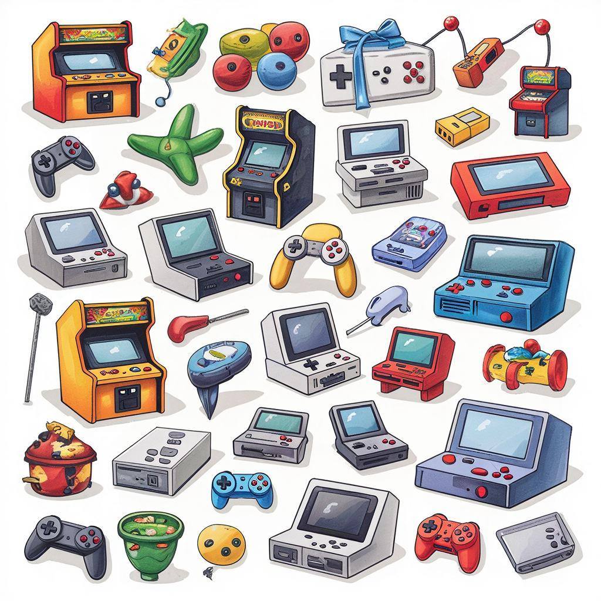

# История видеоигр

Видеоигры – это увлекательные занятия, которые появились сравнительно недавно, но уже стали важной частью нашей культуры и досуга. Представь себе, всего несколько десятилетий назад люди не могли даже представить, что можно играть в игры дома на маленьких коробочках размером с книгу!

## 1. Введение

Видеоигры – это интерактивные программы, созданные специально для того, чтобы развлекать нас и развивать наши навыки. Они бывают разных видов: от простых головоломок до сложных симуляторов и [стратегий](game-genres.md). Игры помогают нам расслабиться после учёбы, развить логику, внимание и реакцию.

## 2. История

Первые видеоигры появились ещё в середине XX века! Это были огромные машины, похожие на компьютеры, стоящие в специальных залах – аркадных автоматах. Одна из самых известных ранних игр называлась Pong («Понг»). Она была очень простой: нужно было отбивать мяч ракеткой вверх-вниз, стараясь не дать ему упасть на свою сторону поля.

Со временем технологии развивались, и игры становились всё сложнее и интереснее. Появились первые домашние консоли, такие как Atari и Nintendo. Эти устройства позволяли людям играть прямо у себя дома, а не только в специальных игровых залах.

В конце XX века начали появляться персональные компьютеры и интернет. Благодаря этому разработчики смогли создавать гораздо более сложные и реалистичные игры. Сегодня мы можем наслаждаться играми на смартфонах, планшетах и мощных персональных компьютерах.

## 3. Основные виды или разновидности

Существует множество различных типов видеоигр:

### **Аркада**
Это простые игры, в которых игрок управляет персонажем или предметом и выполняет определённые задачи за ограниченное время. Например, Pac-Man, где нужно собирать точки и избегать призраков.

### **Стратегия**
Здесь игроку необходимо планировать свои действия и принимать решения, влияющие на исход игры. Пример – Civilization, где ты строишь город и ведёшь его жителей через века.

### **Шутер**
Игроку приходится стрелять по врагам и выполнять задания, используя оружие. Самый известный пример – Call of Duty, где игроки сражаются друг с другом или противниками в виртуальных войнах.

### **Ролевые игры**
Здесь игрок берёт на себя роль персонажа и проходит вместе с ним сюжетную линию. Популярные ролевые игры включают The Witcher и Final Fantasy.

### **Симулятор**
Эти игры позволяют игрокам управлять реальными или вымышленными объектами и наблюдать их развитие. Например, SimCity позволяет строить города и следить за тем, как они растут и развиваются.

## 4. Интересные факты

Вот несколько интересных фактов об играх:

- **Первая игра, выпущенная компанией Nintendo**, появилась в Японии в далёком 1980 году. Называлась она Donkey Kong, и именно там впервые появился персонаж Марио.
  
- **Самая продаваемая игровая приставка всех времён** – это Nintendo Entertainment System (NES), выпущенная в начале 1980-х годов. Её продали более 60 миллионов экземпляров по всему миру.

- **Самое длинное название игры** принадлежит японской игре Dragon Quest IV: Chapters of the Chosen. Оно состоит из 122 символов!

## 5. Примеры из жизни

Вот несколько популярных игр, которые наверняка знакомы твоим друзьям:

- Minecraft – игра, в которой можно строить целые миры из блоков.
- Fortnite – популярная многопользовательская игра, где игроки объединяются, чтобы выжить и победить врагов.
- Super Mario – легендарная серия игр про весёлого водопроводчика Марио, который спасает принцессу из лап Боузера.

## 6. Польза

Видеоигры могут приносить много пользы:

- Развивают внимательность и реакцию благодаря быстрому принятию решений.
- Помогают улучшить координацию движений рук и глаз.
- Учат решать проблемы и находить нестандартные подходы к задачам.
- Позволяют тренировать память и улучшать математические способности.

## 7. Возможные риски

Как и любое занятие, видеоигры могут иметь негативные последствия, если ими злоупотреблять:

- Длительное сидение перед экраном может привести к проблемам со зрением и осанкой.
- Недостаток физической активности снижает выносливость и силу мышц.
- Зависимость от игр мешает учёбе и общению с друзьями.

## 8. Баланс пользы и развлечения

Чтобы получать максимум удовольствия и пользы от игр, важно соблюдать баланс:

- Ограничивай время, проводимое за игрой, например, час-два в день.
- Делай перерывы каждые 15–20 минут, чтобы размяться и отдохнуть.
- Старайся совмещать игры с другими видами деятельности, такими как спорт или чтение книг.

## 9. Заключение

Видеоигры прошли долгий путь от простых аркад до сложных и реалистичных проектов современности. Они продолжают развиваться и становиться всё интереснее и разнообразнее. Главное – помнить о балансе между пользой и развлечением, чтобы получать удовольствие без вреда для здоровья.

---
Автор: Долбус Дмитрий

*LLM - GigaChat*

