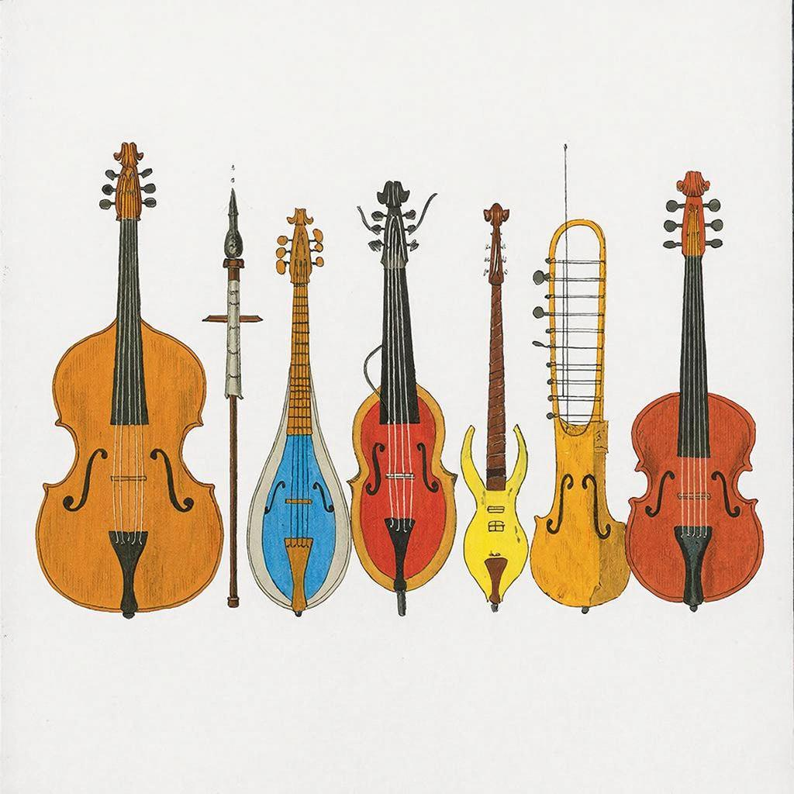

# История музыки

**[Музыка](music.md) – это язык [эмоций](psychology_of_music.md) и чувств.** Она окружает нас повсюду: дома, в школе, на улице и даже в самых неожиданных местах. Но задумывались ли вы когда-нибудь, откуда взялась эта волшебная [мелодия](composer.md)? Давайте вместе погрузимся в историю [музыки](music.md)!

## 2. История

**С давних времён люди использовали музыку как способ общения и выражения своих мыслей.** Представьте себе племя охотников каменного века, которые собирались вокруг костра и пели песни, чтобы поднять боевой дух перед охотой. Это был первый шаг человечества к созданию музыки.

### Этап 1: Древние времена
В древности музыка была тесно связана с религией и обрядами. Люди верили, что определённые [звуки](music.md) могут влиять на природу и богов. Например, древние греки считали, что музыка способна исцелять душу и тело.

### Этап 2: Средневековье
Средние века принесли нам первые [музыкальные инструменты](musical_instruments.md) и нотную грамоту. Монахи создавали гимны и псалмы, которые исполнялись хором. Именно тогда зародились основы гармонии и ритма, которыми мы пользуемся сегодня.

### Этап 3: Эпоха Возрождения
Это время стало настоящим расцветом музыки! [Композиторы](composer.md) начали экспериментировать с новыми формами и [жанрами](music_genres.md). Появляются оперы, балеты и симфонии, которые восхищают людей по сей день.

## 3. Основные виды или разновидности

**Сегодня музыка делится на множество видов и направлений:** 

| Вид музыки | Описание |
|------------|----------|
| Классическая музыка | Произведения великих [композиторов](composer.md) прошлого, такие как Бах, Бетховен и Чайковский. |
| [Поп-музыка](music_genres.md) | Современная популярная музыка, которую слушают миллионы людей во всём мире. |
| [Рок](music_genres.md)-музыка | Музыкальный [жанр](music_genres.md), который появился в середине XX века и стал символом свободы и бунта. |
| [Джаз](music_genres.md) | Музыкальное направление, возникшее в начале XX века в США, отличающееся импровизацией и свободой исполнения. |
| Электронная музыка | Создаётся с использованием компьютеров и специальных программ, часто используется в клубах и вечеринках. |

## 4. Интересные факты

Вот несколько любопытных фактов:

- **Древний Египет**: Удивительно, но уже более 4000 лет назад египтяне играли на флейтах и арфах!
- **Первая нотация**: Около 1000 года нашей эры монах Гвидо д'Ареццо изобрёл систему записи музыкальных звуков с помощью четырёх линий.
- **[Музыкальные инструменты](musical_instruments.md)**: Самый старый музыкальный инструмент – это флейта, найденная археологами в Германии возрастом около 43 тысяч лет!

## 5. Примеры из жизни

Представьте себе вечер в кино! Во время просмотра захватывающего фильма герои переживают невероятные [эмоции](psychology_of_music.md) благодаря музыке. Без неё фильм потерял бы половину своей магии. Вот несколько примеров известных песен и [фильмов](movie.md):

- **«My Heart Will Go On» из фильма «Титаник».**
- **«Imagine» Джона Леннона.**
- **«Bohemian Rhapsody» группы Queen.**

## 6. Польза

**Музыка приносит много пользы нашему развитию и обучению:**

- Улучшает [настроение](psychology_of_music.md) и помогает справляться со стрессом.
- Развивает творческие способности и воображение.
- Способствует улучшению памяти и концентрации внимания.
- Помогает выражать свои чувства и переживания.

## 7. Возможные риски

Как и всё в этом мире, музыка тоже имеет свои подводные камни:

- Чрезмерное увлечение прослушиванием громкой музыки может повредить слух.
- Некоторые современные направления содержат тексты, которые могут негативно повлиять на психику ребёнка.

## 8. Баланс пользы и развлечения

Чтобы получать максимальную пользу от музыки и избежать возможных [рисков](gambling-and-harm.md), важно соблюдать следующие правила:

- Ограничивайте время прослушивания громких треков.
- Выбирайте качественные музыкальные произведения, подходящие вашему возрасту.
- Учите детей критически оценивать содержание текстов песен.

## 9. Заключение

Таким образом, история музыки – это увлекательный путь человеческого духа и воображения. Слушайте музыку осознанно, наслаждайтесь её красотой и развивайтесь духовно и интеллектуально!

---
Автор: Канева Юлия

*LLM - GigaChat*

