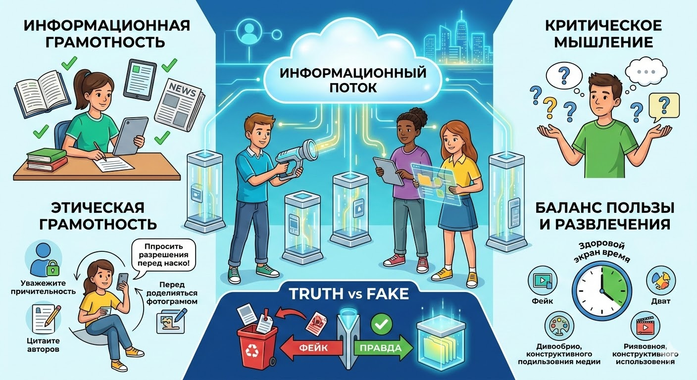

# Медиаграмотность

Сегодня мы живём в мире информации и медиа. Каждый день нас окружают разные источники информации: книги, газеты, телевидение, интернет, игры и [музыка](music.md). Чтобы разобраться во всём этом многообразии и не потеряться среди фейков и заблуждений, нам нужна особая способность – медиаграмотность. 

## Что такое медиаграмотность?

Представь себе, что ты находишься в огромном магазине игрушек. Ты можешь взять любую игрушку, но чтобы выбрать именно ту, которая тебе понравится и будет полезной, нужно уметь её внимательно рассмотреть, прочитать инструкцию и понять, подходит ли она по возрасту и интересам. Точно так же и с информацией: важно уметь анализировать, проверять достоверность и понимать, насколько эта информация полезна лично тебе.

## История медиаграмотности

Когда-то давно люди узнавали новости только через устную речь или письма. С появлением книг и газет ситуация изменилась. Но настоящий прорыв произошёл с изобретением радио и телевидения. Люди получили возможность мгновенно получать новости со всего мира прямо у себя дома. Однако вместе с этим появились и проблемы: недостоверная информация стала распространяться быстрее, чем правда. Именно тогда начали задумываться о том, как научить людей критически относиться к получаемой информации.

### Ключевые этапы развития:
- **Конец XIX века:** Появление первых учебников по журналистике и курсы для журналистов.
- **1960-е годы:** Возникновение термина "медиаграмотность" и первые исследования в этой области.
- **Современность:** Сегодня медиаграмотность включает в себя навыки работы с разными видами медиа и умение оценивать их качество.

## Основные виды медиаграмотности

Есть несколько важных аспектов, которые помогают нам стать медиаграмотными людьми:

### Информационная грамотность
Это умение находить нужную информацию и различать правду от вымысла. Например, если ты хочешь узнать про динозавров, лучше обратиться к книге или проверенному сайту, а не верить первому попавшемуся блогеру.

### Критическое мышление
Критически мыслить значит задавать вопросы: кто написал эту книгу? Почему этот [фильм](movie.md) так популярен? Зачем авторы создали эту игру? Это помогает тебе самому принимать решения, а не слепо следовать чужим советам.

### Этическая грамотность
Этические нормы помогают нам уважительно относиться к другим людям и их мнению. Например, не выкладывать фотографии других без разрешения и не использовать чужие идеи без указания автора.

## Интересные факты

Вот несколько интересных и забавных фактов о медиаграмотности:

- **Фейк-ньюс:** Исследования показывают, что подростки чаще верят фейковым новостям, потому что они увлекаются сенсациями и хотят быстро получить интересную информацию.
- **Влияние рекламы:** Реклама влияет на наше восприятие продуктов и услуг гораздо сильнее, чем кажется. Например, реклама сладостей часто делает их более привлекательными и аппетитными, хотя в реальной жизни они могут выглядеть иначе.
- **Социальные сети:** Более половины подростков проводят в социальных сетях больше времени, чем общаются лицом к лицу. Это может привести к изоляции и снижению навыков общения в реальном мире.

## Примеры из жизни

Рассмотрим несколько примеров того, как медиаграмотность проявляется в обычной жизни:

- **Интернет:** Если ты читаешь статью в интернете, всегда проверяй источник и дату публикации. Хороший сайт обычно указывает имя автора и его квалификацию.
- **Телевизор:** Перед просмотром новостей подумай, откуда берутся эти новости? Какие цели преследуют журналисты? Какую точку зрения они представляют?
- **Игры и [мультфильмы](animation.md):** Всегда обращай внимание на возрастные ограничения и содержание игр и [фильмов](movie.md). Иногда даже самые популярные [мультфильмы](animation.md) содержат [сцены](script.md) насилия или ненормативную лексику.

## Польза медиаграмотности

Медиаграмотный человек умеет:

- Самостоятельно искать и выбирать полезную информацию.
- Развивать критическое мышление и принимать осознанные решения.
- Защищаться от манипуляций и дезинформации.
- Создавать свои собственные произведения искусства и делиться ими с другими.

## Возможные риски неправильного использования медиа

Если неправильно пользоваться медиа, можно столкнуться с такими проблемами:

- **Зависимость от гаджетов:** Постоянное использование смартфонов и планшетов может привести к проблемам со зрением и сном.
- **Дезинформация:** Фейковые новости и ложные утверждения могут повлиять на твоё мнение и поведение.
- **Изоляция:** Чрезмерное пребывание в социальных сетях может привести к социальной изоляции и отсутствию живого общения.

## Баланс пользы и развлечения

Чтобы правильно использовать медиа и получать максимум пользы, следуй простым правилам:

- **Ограничивай время:** Установи лимиты на использование гаджетов и телевизора.
- **Выбирай качественное:** Обращай внимание на рейтинги и отзывы перед тем, как смотреть [фильм](movie.md) или играть в игру.
- **Общайся:** Обсуди увиденное или прочитанное с родителями или друзьями.

## Заключение

Итак, медиаграмотность – это важный навык, который поможет тебе ориентироваться в современном информационном пространстве и делать правильный выбор. Будь внимательным, критичным и ответственным потребителем медиа!

---
Автор: Глушко Игорь

*LLM - GigaChat*

