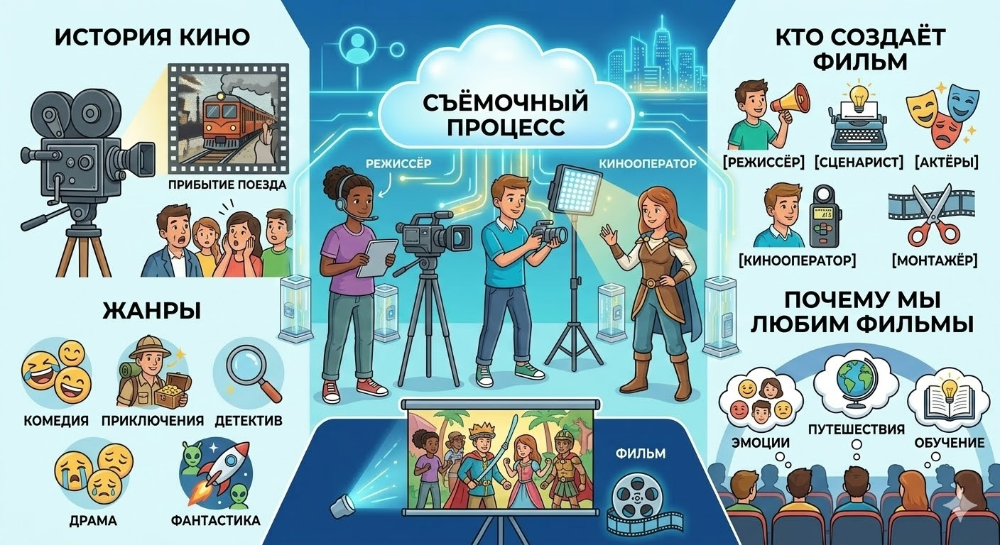

# Фильм

## Что такое фильм?

Фильм — это особый вид искусства, который рассказывает истории с помощью движущихся картинок и [звуков](music.md). Это своего рода волшебный мир, созданный [режиссерами](director.md), [сценаристами](script.md), актёрами и множеством других людей, работающих над созданием кино.

## Как появился первый фильм?

Первый настоящий фильм был снят во Франции в конце XIX века. Его создатель — Луи Люмьер, известный французский изобретатель. В декабре 1895 года он продемонстрировал публике короткометражное кино под названием *«Прибытие поезда на вокзал Ла Сьота»*. Этот простой ролик стал настоящей сенсацией! Люди сначала даже испугались, думая, что поезд вот-вот выедет прямо из экрана.

## Почему фильмы так популярны?

Фильмы интересны тем, что переносят нас в другой мир, где мы можем увидеть разные страны, эпохи и приключения. Они помогают нам узнать больше о жизни других людей, о культуре разных народов и эпохах прошлого. Мы погружаемся в [сюжеты](script.md), переживаем вместе с героями радость и печаль, смех и слёзы.

## Какие бывают жанры фильмов?

Существует много различных видов фильмов, каждый из которых имеет свою особую атмосферу и характер:

- **Комедии** — веселые и смешные фильмы, поднимающие [настроение](psychology_of_music.md) и вызывающие улыбку.
- **Приключенческие фильмы** — захватывающие путешествия и невероятные события.
- **Детективы** — таинственные загадки и расследования.
- **Драмы** — эмоциональные и трогательные истории, заставляющие задуматься о жизни.
- **Фантастика** — необычные миры, фантастические существа и удивительные технологии будущего.

## Кто участвует в создании фильма?

Чтобы фильм получился интересным и качественным, важно участие множества специалистов:

- **[Режиссёр](director.md)** — человек, руководящий [съёмочным процессом](director.md) и определяющий стиль и направление картины.
- **[Сценарист](script.md)** — автор [сценария](script.md), который придумывает сюжет и [диалоги](script.md) героев.
- **Актёры** — люди, играющие роли персонажей, выражающие [эмоции](psychology_of_music.md) и чувства через игру перед камерой.
- **Кинооператоры** — специалисты, отвечающие за качество картинки и освещение сцены.
- **Монтажёры** — профессионалы, соединяющие отдельные [кадры](montage.md) в единое повествование.

## Фильмы и культура

Через фильмы дети учатся понимать и ценить культурное наследие своей страны и всего мира. Каждый фильм — это маленькое путешествие в прошлое, настоящее и будущее, которое помогает лучше осознать окружающий мир и себя в нём.

## Заключение

Фильм — удивительное искусство, способное увлечь, вдохновить и научить. Он объединяет людей разных возрастов и стран, позволяя каждому найти своё отражение в мире кинематографа.

---
Автор: Фролов Матвей

*LLM - GigaChat*

