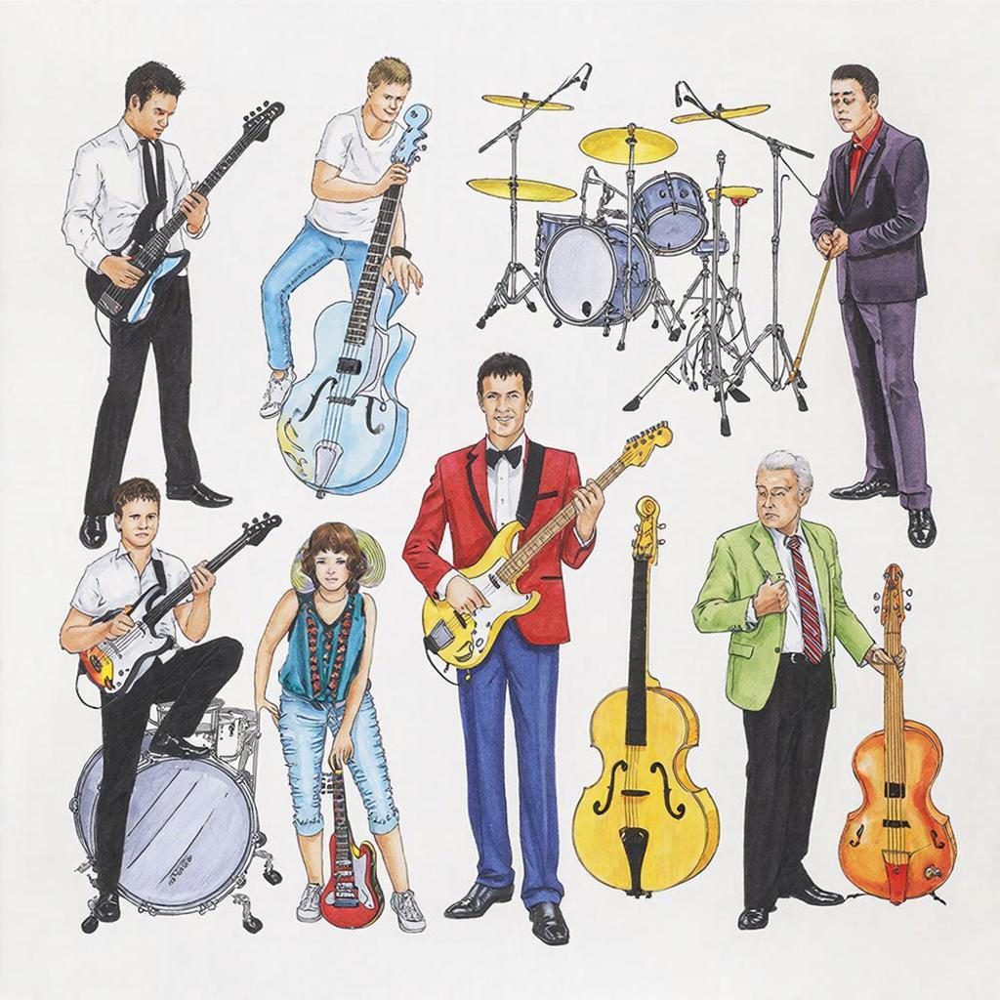

# Жанры музыки

## Что такое жанры музыки?

Представь себе большой магазин игрушек. Там есть мягкие мишки, конструкторы, машинки и куклы – каждая игрушка своя, но все они радуют детей по-разному. Так же и с [музыкой](music.md)! Жанры [музыки](music.md) – это разные музыкальные направления, которые созданы для того, чтобы радовать нас разными [эмоциями](psychology_of_music.md) и [настроениями](psychology_of_music.md). Например, классическая музыка помогает расслабиться и успокоиться, а рок поднимает [настроение](psychology_of_music.md) и заряжает энергией.

## История жанров музыки

Давным-давно люди пели песни под гитару у костра, играли на флейте и барабанах, создавая первые [мелодии](composer.md). С тех пор музыка прошла долгий путь развития:

### Этап первый: Древние времена
Музыка появилась ещё тогда, когда наши предки собирали ягоды и охотились на мамонтов. Тогда не было ни роялей, ни электрогитар, только простые инструменты вроде барабанов и деревянных трещоток.

### Этап второй: Средневековье
В средние века появились церковные хоралы и баллады, которые рассказывали истории о подвигах героев и святых.

### Этап третий: Эпоха Возрождения
С развитием городов и торговли начали появляться новые музыкальные формы, такие как опера и балет.

### Этап четвёртый: XIX век и далее
Появляются симфонии, оперы, романсы и множество других направлений, каждое из которых отличается своим звучанием и смыслом.

## Основные виды или разновидности

Есть много разных музыкальных жанров, вот самые популярные:

### Классическая музыка
Это серьёзная и сложная музыка, написанная великими [композиторами](composer.md), такими как Бетховен, Моцарт и Чайковский. Она звучит торжественно и величественно, часто исполняется [оркестром](musical_instruments.md) и певцами.

### Рок-музыка
Рок – это энергичная и громкая музыка, которая заставляет танцевать и подпевать. Самые известные группы – The Beatles, Queen, Metallica.

### Джаз
Джаз появился в начале XX века в США и сочетает в себе элементы блюза и европейской музыки. Это импровизационная музыка, которую играют на таких инструментах, как труба, саксофон и пианино.

### Поп-музыка
Поп-музыка популярна среди молодёжи благодаря простым [мелодиям](composer.md) и ярким текстам. Такие звёзды, как Майкл Джексон, Бритни Спирс и Бейонсе, стали настоящими иконами поп-[сцены](script.md).

### Хип-хоп и рэп
Хип-хоп и рэп возникли в конце XX века в Соединённых Штатах Америки. Эти жанры используют ритмичные тексты, читаемые под битовые мелодии.

## Интересные факты

Вот несколько любопытных фактов о музыке:

- **Самый длинный музыкальный альбом** был выпущен группой King Crimson в 1994 году и длился целых 8 часов!
- **Самая быстрая песня** называется "The Blue Tango" и была исполнена аргентинским музыкантом Альберто Гонсалесом в 1999 году со скоростью 40 ударов в секунду.
- **Самое большое количество инструментов** одновременно играло во время записи альбома "Symphony No. 9" австрийского [композитора](soundtrack.md) Густава Малера в 1910 году – более ста музыкантов!

## Примеры из жизни

Послушай, например, песню "Imagine" Джона Леннона. Эта спокойная композиция призывает людей жить в мире и дружбе. Или вспомни хит "Bohemian Rhapsody" группы Queen – она полна загадочных слов и необычных музыкальных ходов.

## Польза

Музыка приносит много пользы нашему развитию:

- **Улучшает память**: многие дети учат стихи под музыку, потому что [ритм](music.md) помогает лучше запоминать слова.
- **Развивает воображение**: слушая музыку, мы представляем себе картины и образы, описанные в песнях.
- **Поднимает настроение**: весёлые песни помогают нам чувствовать себя счастливее и бодрее.

## Возможные риски

Как и всё хорошее, музыка тоже имеет свои подводные камни:

- **Переизбыток шума**: слишком громкие звуки могут повредить слух.
- **Неподходящий контент**: некоторые песни содержат ненормативную лексику или темы, неподходящие для детского возраста.

## Баланс пользы и развлечения

Чтобы получать от музыки максимум удовольствия и пользы, нужно соблюдать следующие правила:

- **Выбирай подходящие треки**: избегай песен с грубым содержанием и слишком громким звуком.
- **Не забывай отдыхать**: после долгого прослушивания музыки давай ушам отдохнуть.
- **Учись различать жанры**: попробуй слушать разную музыку, чтобы понять, какая нравится именно тебе.

## Заключение

Итак, жанры музыки – это разнообразие стилей и направлений, которые делают нашу жизнь ярче и интереснее. Главное – уметь выбирать то, что подходит именно тебе, и наслаждаться этим с умом и удовольствием!

---
Автор: Хабирова Амина

*LLM - GigaChat*

