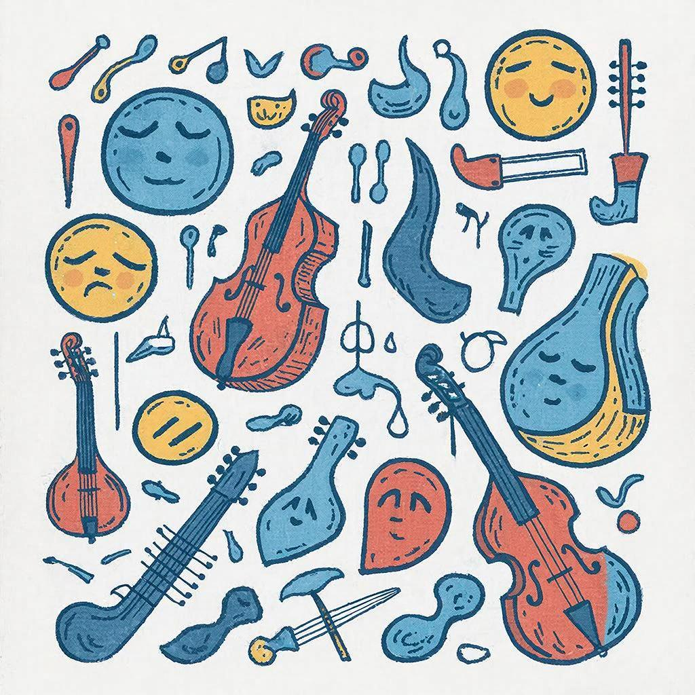

# Влияние музыки на человека.

[Музыка](music.md) окружает нас повсюду – она звучит в наушниках друзей, играет по радио в машине родителей и сопровождает наши любимые игры и [фильмы](movie.md). Но задумывались ли вы когда-нибудь, какое влияние оказывает [музыка](music.md) на наше эмоциональное состояние, внимание, память и даже самочувствие? Давайте разберёмся вместе!

## История

Музыка появилась очень давно, ещё до нашей эры! Люди использовали её для общения, выражения эмоций и передачи традиций от поколения к поколению. Например, древние греки считали музыку важной частью образования и культуры. Со временем музыка стала неотъемлемой частью различных культур и цивилизаций, развиваясь параллельно с обществом. Сегодня мы можем увидеть множество [жанров](music_genres.md) и стилей, которые появились благодаря музыкальным экспериментам и новым технологиям.

### Ключевые этапы развития:
- **Древние времена:** использование барабанов, флейт и других примитивных инструментов.
- **Средневековье:** появление хорового пения и церковной музыки.
- **Эпоха Возрождения:** развитие инструментальной музыки и оперного жанра.
- **XX век:** появление [джаза](music_genres.md), [рок](music_genres.md)-н-ролла и электронной музыки.

## Основные виды или разновидности

Существует огромное количество музыкальных направлений и жанров. Вот несколько самых популярных:

### 1. Классическая музыка
Это серьёзная и сложная музыка, написанная великими [композиторами](composer.md) прошлого, например, Бетховеном, Моцартом и Чайковским. Она помогает развивать чувство прекрасного и улучшает концентрацию внимания.

### 2. Рок-музыка
Громкая и энергичная музыка, часто используемая подростками для выражения своих чувств и эмоций. [Рок](music_genres.md)-музыка также способствует развитию креативности и уверенности в себе.

### 3. Поп-музыка
Простые [мелодии](composer.md) и запоминающиеся тексты делают поп-музыку популярной среди широкой аудитории. Часто используется в рекламных кампаниях и [фильмах](movie.md).

### 4. Электронная музыка
Создаётся с помощью компьютеров и специальных программ. Отличается необычными звуками и [ритмами](music.md), которые могут вдохновлять на творчество и эксперименты.

## Интересные факты

Вот несколько любопытных фактов о музыке:

- **Музыкальные тренировки улучшают когнитивные способности.** Учёные доказали, что игра на [музыкальных инструментах](musical_instruments.md) развивает мозг и улучшает математические навыки.
- **Некоторые песни способны вызывать воспоминания.** Вы наверняка замечали, что услышав знакомую песню, сразу вспоминаете определённые моменты своей жизни.
- **Музыка снижает стресс.** Исследования показывают, что прослушивание спокойной музыки помогает расслабиться и успокоиться после напряжённого дня.

## Примеры из жизни

Представьте себе такие ситуации:

- **Прослушивание любимой песни перед экзаменом** помогает сосредоточиться и настроиться на успех.
- **Звучание музыки во время спортивных тренировок** увеличивает выносливость и мотивацию.
- **Фоновая музыка в кафе или магазине** создаёт приятную атмосферу и улучшает настроение посетителей.

## Польза

Музыка приносит много пользы нашему организму и психике:

- Улучшает настроение и снимает стресс.
- Способствует развитию творческих способностей и воображения.
- Помогает улучшить память и концентрацию.
- Укрепляет социальные связи и объединяет людей.

## Возможные риски

Однако не стоит забывать и о возможных негативных последствиях чрезмерного увлечения музыкой:

- Слишком громкие звуки могут повредить слух.
- Прослушивание агрессивной музыки может вызвать негативные эмоции и раздражительность.
- Длительное сидение за компьютером или телефоном с наушниками ухудшает зрение и осанку.

## Баланс пользы и развлечения

Чтобы получать максимум удовольствия и пользы от музыки, важно соблюдать баланс между развлечением и обучением:

- Ограничивайте время прослушивания громкой музыки.
- Выбирайте качественные наушники и следите за [уровнем](gamification.md) громкости.
- Делайте перерывы во время занятий под музыку, чтобы избежать усталости глаз и слуха.

## Заключение

Таким образом, музыка является мощным инструментом влияния на нашу жизнь. Она способна дарить радость, улучшать настроение и помогать развиваться интеллектуально и творчески. Главное – помнить о балансе и использовать музыку разумно и с пользой.

---
Автор: Канева Юлия

*LLM - GigaChat*

