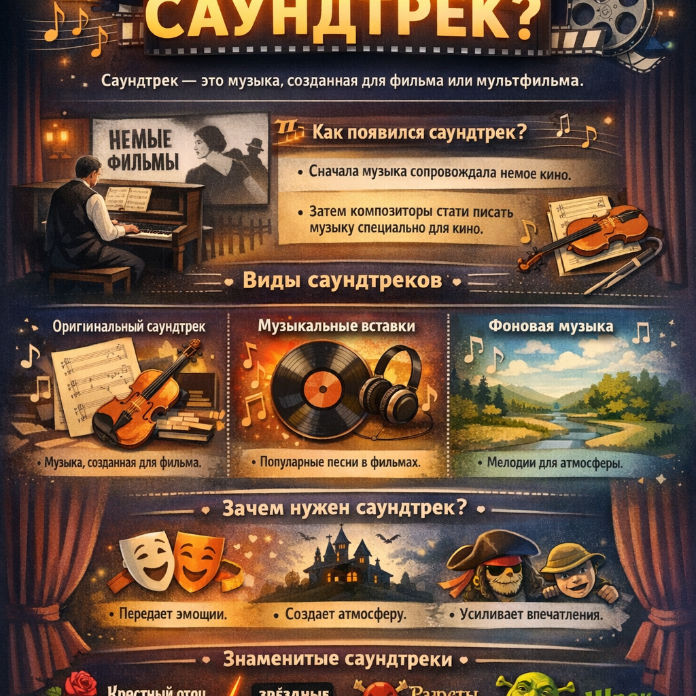

# Саундтрек — музыкальное сопровождение [фильма](movie.md)

## Тема

Саундтрек (иногда говорят «саунд-трек», «саундтрэк») — это музыкальная композиция или запись, специально созданная для [фильма](movie.md), [мультфильма](animation.md), спектакля или другого аудиовизуального произведения. [Музыка](music.md) в [фильмах](movie.md) играет важную роль, она помогает зрителям лучше понимать [сюжет](script.md), погружаться в атмосферу и переживать [эмоции](psychology_of_music.md) героев вместе с ними.

## Как появился саундтрек?

Еще в далекие времена немого [кино](movie.md) актеры играли роли молча, и зрители ничего не слышали кроме звуков окружающего мира. Когда [фильмы](movie.md) стали озвучивать [звуком](music.md), [режиссеры](director.md) поняли, насколько важно музыкальное сопровождение. Так впервые появились музыкальные композиции специально для [фильмов](movie.md).

Первоначально саундтреки создавались [композиторами](composer.md), которые писали музыку для конкретных [сцен](script.md). Например, знаменитые песни из [фильмов](movie.md) про супергероев («Бэтмен», «Человек-паук»), [мультфильмов](animation.md) («Король Лев», «Зверополис») или документальных картин часто запоминаются надолго благодаря своей мелодичности и эмоциональной силе.

## Зачем нужен саундтрек?

Музыкальное сопровождение делает [фильм](movie.md) живым и выразительным. Оно помогает передать [настроение](psychology_of_music.md) картины: радость, грусть, волнение, страх или восхищение. Представь себе веселый мультфильм про приключения животных — музыка сделает просмотр еще ярче и увлекательнее.

Например, вспомни песню из популярного мультфильма «Мадагаскар». Она создает ощущение беззаботности и тепла даже тогда, когда животные попадают в непростую ситуацию.

## Какие бывают виды саундтреков?

Есть несколько видов саундтреков:

### Оригинальный саундтрек

Это музыка, написанная специально для конкретного [фильма](movie.md). Композиторы создают оригинальные мелодии, которые идеально подходят к происходящему на экране.

### Музыкальные вставки

Иногда уже существующие песни становятся частью [фильма](movie.md). Это могут быть популярные хиты или классические произведения, которые вписываются в сюжетную линию и помогают раскрыть характер персонажей.

### Фоновая музыка

Фоновые мелодии играют свою особую роль, создавая общую атмосферу картины. Они помогают зрителю настроиться на нужный лад перед началом просмотра или сцены.

## Примеры известных саундтреков

Многие [фильмы](movie.md) имеют свои легендарные саундтреки, которые остаются популярными долгие годы. Вот некоторые из них:

- **«Крестный отец»** — классика гангстерского жанра с потрясающей музыкой Нино Роты.
- **«Звёздные войны»** — знаменитая тема Джона Уильямса стала символом целой эпохи научной [фантастики](movie.md).
- **«Пираты Карибского моря»** — волшебная музыка Ханса Циммера добавила [фильму](movie.md) особого шарма.
- **«Шрек»** — популярный мультфильм с незабываемыми песнями Стивена Вуллифа и Брайана Тайлера.

## Почему саундтрек важен?

Саундтрек — важная составляющая любого [фильма](movie.md). Без музыки зритель мог бы чувствовать себя отстраненным от происходящего на экране, не испытывать эмоций и сопереживания героям. Именно саундтрек позволяет нам глубже проникнуть в мир кинематографа и насладиться каждым моментом истории вместе с персонажами.

Послушай саундтрек любимого [фильма](movie.md) или мультфильма снова и почувствуй, какое влияние он оказывает на твои впечатления!

---
Автор: Хереш Артемий

*LLM - GigaChat*

