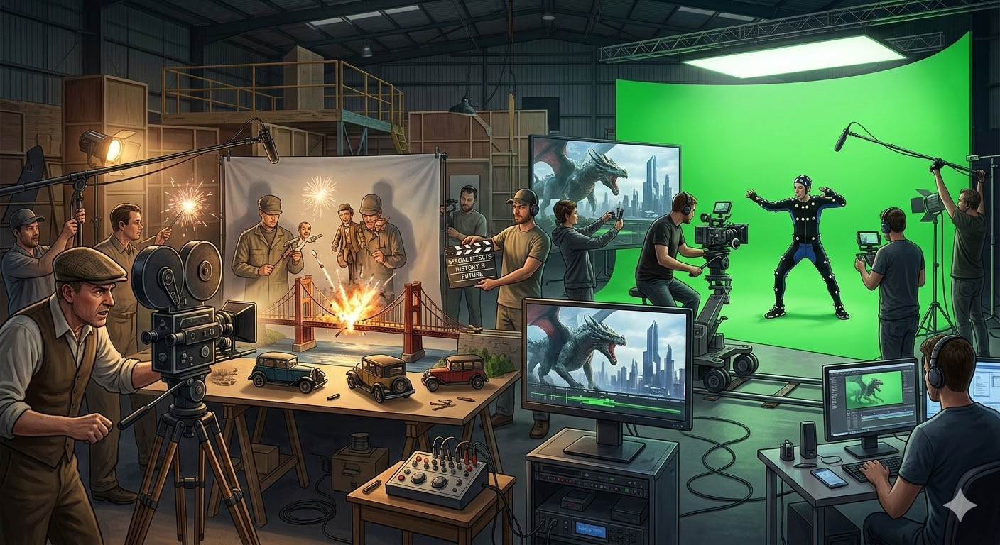

# Спецэффекты в кино и мультфильмах

## Тема: Спецэффекты

Спецэффекты — это различные техники и технологии, благодаря которым создаются удивительные и фантастические [сцены](script.md) в [фильмах](movie.md), сериалах и [мультфильмах](animation.md). Они помогают [режиссерам](director.md) показать зрителям невероятные события, космические миры, волшебство и [фантастику](movie.md), которых невозможно снять обычными способами.

## Как появились спецэффекты?

Долгое время [фильмы](movie.md) снимали простыми методами: актеры играли перед камерой, а декорации создавались вручную. Но иногда [режиссеры](director.md) хотели показать такие зрелищные [сцены](script.md), которые было сложно реализовать обычными средствами. Тогда и начали появляться первые специальные эффекты.

Первые спецэффекты использовали еще в конце XIX века. Например, во времена немого [кино](movie.md) актеры могли исчезать с экрана буквально за секунду, оставаясь невидимыми для зрителей! Это делалось с помощью специальных механизмов, которые прятали актеров с помощью особого освещения и теней.

Позже, когда появилось звуковое [кино](movie.md), [режиссеры](director.md) стали использовать сложные механизмы и компьютеры для создания потрясающих сцен.

## Какие бывают виды спецэффектов?

### 1. Живые съемки и компьютерная графика
Современные технологии позволяют снимать [кадры](montage.md), где смешиваются реальные объекты и цифровые персонажи или сцены. Например, актера снимают отдельно, а потом на компьютере добавляют виртуальных существ, космических кораблей или магические предметы.

### 2. Механические и пиротехнические эффекты
Это те самые трюки, которые мы видим в старых приключенческих [фильмах](movie.md). Например, взрывающиеся корабли, падающие здания, взрывы и огненные вспышки. Эти эффекты требуют особых устройств и больших затрат, зато выглядят невероятно реалистично!

### 3. Маскировка и комбинированные съемки
Иногда спецэффекты создаются с помощью простых приемов. Например, в [фильме](movie.md) можно снять одного актера, а другого нарисовать на заднем плане, чтобы казалось, будто они взаимодействуют друг с другом. Или же устроить маленькую сцену с использованием миниатюрных моделей и проекций.

### 4. Анимация и кукольные модели
Куклы и анимационные персонажи часто используются в [мультфильмах](animation.md) и детских [фильмах](movie.md). Благодаря этому создается ощущение настоящего живого существа даже там, где реальных животных или людей быть не может.

## Зачем нужны спецэффекты?

Благодаря спецэффектам зрители получают возможность увидеть то, что невозможно создать в реальной жизни. Это могут быть далекие планеты, необычные существа, захватывающие сражения или фантастические приключения. Именно спецэффекты делают [фильмы](movie.md) увлекательными и незабываемыми.

## Где применяются спецэффекты?

Сегодня спецэффекты активно используют не только в кино и мультфильмах, но и в рекламе, играх и даже театральных [постановках](director.md). С помощью современных технологий [режиссеры](director.md) создают целые вселенные, полные магии и чудес.

Например, вы смотрели [фильм](movie.md) «Звездные войны», «Аватар» или мультфильм «Корпорация монстров»? Все эти [фильмы](movie.md) были бы совсем другими без замечательных спецэффектов!

## Заключение

Без спецэффектов многие любимые нами [фильмы](movie.md) и мультфильмы потеряли бы свою уникальность и интересность. Поэтому создатели [фильмов](movie.md) постоянно придумывают новые способы удивлять зрителей новыми технологиями и необычными идеями.

---
Автор: Фролов Матвей

*LLM - GigaChat*

