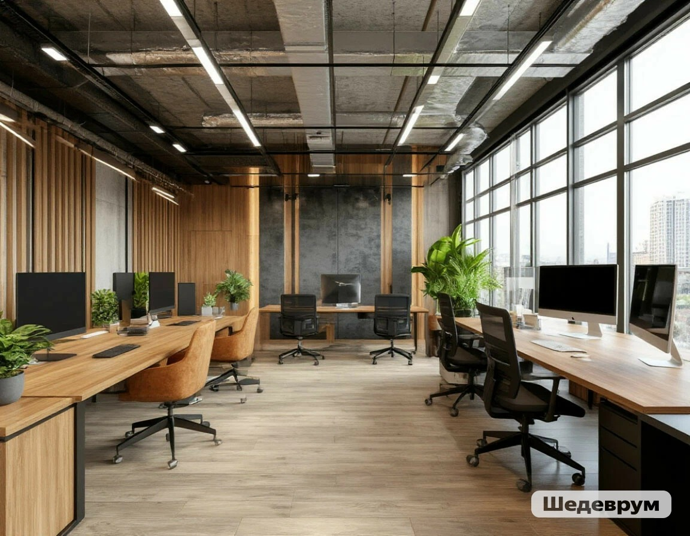

# Офис и удалёнка

## Где можно работать?

Раньше почти все ходили в **офис** — специальное здание или помещение, где стояли столы, компьютеры и работали сотрудники. Но сейчас мир изменился! Всё больше людей работают из дома. Это называется **удалёнка**.

А некоторые выбирают **гибридный формат**: пару дней в офисе, пару дней дома. Или даже работают из кафе, коворкингов и других городов!

---

## Офис: за и против

*(Подсказка для генерации картинки: Просторный светлый офис с большими окнами, растениями в горшках, люди сидят за удобными столами, кто-то пьёт кофе на мягком диване, в воздухе летают постеры с графиками, стиль — современный и уютный)*

### Плюсы офиса ✅

| Что нравится | Почему |
| :--- | :--- |
| **Живое общение** | Можно перекинуться парой слов, обсудить задачу лично, спросить совета. |
| **Чёткие границы** | Пришёл в 9, ушёл в 18. Работа не смешивается с домом. |
| **Оборудование** | В офисе есть всё: мощные компьютеры, принтеры, удобные кресла. |
| **Атмосфера** | Когда вокруг работают — легче настроиться самому. |

### Минусы офиса ❌

| Что не нравится | Почему |
| :--- | :--- |
| **Дорога** | Тратишь время и силы, чтобы добраться. В больших городах это часы жизни! |
| **Меньше свободы** | Нельзя уйти пораньше к врачу или поработать в пижаме. |
| **Шум и отвлечения** | Коллеги разговаривают, кто-то смеётся — сосредоточиться сложнее. |

---

## Удалёнка: за и против

*(Подсказка для генерации картинки: Молодой человек в уютной домашней одежде сидит за столом у окна, на столе ноутбук и чашка чая, рядом спит кот, солнечный свет падает на клавиатуру, уютная домашняя атмосфера)*

### Плюсы удалёнки ✅

| Что нравится | Почему |
| :--- | :--- |
| **Нет дороги** | Экономия времени и денег. Можно поспать подольше! |
| **Гибкий график** | Можно начать раньше или позже, сделать перерыв на спорт. |
| **Сам себе хозяин** | Сам организуешь своё рабочее место и расписание. |
| **Работа откуда угодно** | Хоть из другого города, хоть из кафе на берегу моря. |

### Минусы удалёнки ❌

| Что не нравится | Почему |
| :--- | :--- |
| **Одиночество** | Нет живого общения, можно чувствовать себя изолированным. |
| **Сложно отключиться** | Работа затягивается на вечер, выходные. Нет чёткой границы. |
| **Дисциплина** | Нужно самому себя заставлять работать, а не отвлекаться на сериалы. |
| **Домашние отвлекают** | Сложно сосредоточиться, если рядом кто-то есть. |

---

## Как устроить идеальное рабочее место дома?

Если ты работаешь из дома, важно создать **рабочее место**, которое поможет тебе быть продуктивным.

Вот чек-лист хорошего домашнего офиса:

- [ ] **Отдельное место** (не кровать и не диван)
- [ ] **Удобный стул** — спина скажет спасибо
- [ ] **Хороший свет** (желательно естественный)
- [ ] **Тишина или наушники**
- [ ] **Всё под рукой** — ручки, блокнот, зарядка, вода

> [!NOTE]
> Твоя спина и глаза будут благодарны, если ты правильно организуешь рабочее пространство. Не экономь на стуле и мониторе!

---

## Гибридный формат: лучшее из двух миров?

Многие компании выбирают **гибридный формат**: сотрудники сами решают, когда приезжать в офис, а когда оставаться дома.

**Как это работает:**
- Общие встречи и важные созвоны — в офисе (чтобы все собрались)
- Глубокую работу (когда нужно сосредоточиться) делаешь дома
- Можно выбрать дни: например, вторник и четверг — в офисе, остальное — дома

Такой формат даёт и живое общение, и свободу. Многие считают его самым удобным!

---

## Что выбрать?

Нет правильного ответа для всех. Всё зависит от тебя:

| Ты такой... | Тебе подойдёт... |
| :--- | :--- |
| Любишь общаться, легко заводишь друзей, тебя заряжает атмосфера | **Офис** |
| Ценишь тишину, умеешь себя организовывать, хочешь больше свободы | **Удалёнка** |
| Любишь и то, и другое, хочешь гибкости | **Гибрид** |

> [!TIP]
> Даже если ты работаешь из дома, не забывай общаться с коллегами! Зови их на кофе (онлайн или офлайн), участвуй в общих чатах. Так ты не будешь чувствовать себя одиноко.

---

## Итог

**Офис** и **удалёнка** — это не просто место работы. Это образ жизни.

- **Офис** даёт общение и структуру.
- **Удалёнка** даёт свободу и комфорт.
- А **гибрид** позволяет взять лучшее от обоих миров.

Главное — найти формат, в котором ты будешь и эффективным, и счастливым. И помни: даже если ты работаешь один дома, ты всё равно часть команды! 🤝

---

**Автор:** Кирюхин Георгий

*Использованные нейросети: DeepSeek (генерация текста), Midjourney (генерация изображений)*
